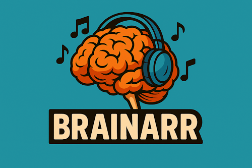

# Brainarr - AI-Powered Music Discovery for Lidarr

<p align="left">
  
 </p>

[](LICENSE)
[](https://dotnet.microsoft.com/download)
[](https://lidarr.audio/)
[](https://github.com/RicherTunes/Brainarr/releases/tag/v1.2.1)
[](CHANGELOG.md)
[](https://github.com/RicherTunes/Brainarr/actions/workflows/docs-lint.yml)
[](https://github.com/RicherTunes/Brainarr/actions/workflows/pre-commit.yml)

Brainarr is a local-first, multi-provider AI-powered import list plugin for Lidarr that generates intelligent music recommendations using both local and cloud AI models. It supports 9 different AI providers, from privacy-focused local options to powerful cloud services, with automatic failover and health monitoring.

> *Local-first design.* Brainarr runs great with **local providers** (Ollama, LM Studio). You can optionally enable **cloud providers** (OpenAI, Anthropic, Gemini, Perplexity, Groq, DeepSeek, OpenRouter) with automatic failover and health monitoring when you need extra scale.

> Compatibility Notice
> Requires Lidarr 2.14.1.4716+ on the plugins/nightly branch. In Lidarr: Settings > General > Updates > set Branch = nightly. If you run an older Lidarr, upgrade first — otherwise the plugin will not load.
>
> The plugin fails closed on unsupported Lidarr versions. If Brainarr does not appear after install, check **System → Logs** for `Brainarr: minVersion` messages and confirm Lidarr is tracking the `nightly` branch.
>
> Provider Status
> Latest release: **v1.2.1** (tagged). Main branch version: **v1.2.4** (in development — not yet released).
>
> | Provider | Type | Status |
> | --- | --- | --- |
> | LM Studio | Local | ✅ Verified on latest main build (rolling toward v1.2.4) |
> | Gemini | Cloud | ✅ Verified on latest main build (rolling toward v1.2.4) |
> | Perplexity | Cloud | ✅ Verified on latest main build (rolling toward v1.2.4) |
> | Ollama | Local | 🔄 Pending smoke-test update for v1.2.x |
> | OpenAI, Anthropic, DeepSeek, Groq, OpenRouter | Cloud | ⚠️ Experimental — enable with caution until verification lands |
>
> See the "Local Providers" and "Cloud Providers" wiki pages for setup tips and quick smoke tests, and share verification notes via issues/PRs to promote providers out of experimental status.

## Features

## Privacy & Flexibility

- **Local-First**: Privacy-focused local providers (Ollama, LM Studio) available by default
- Tip: See wiki "Hallucination-Reduction" for model/prompt guidance

- **Optional Cloud Support**: 9 AI providers including OpenAI, Anthropic, Google Gemini
- **Gateway Access**: OpenRouter integration for 200+ models with one API key
- **Cost Options**: Budget-friendly options like DeepSeek and free-tier Gemini

## Intelligence & Performance

- **Auto-Detection**: Automatically discovers available AI models
- **Smart Caching**: Reduces redundant AI processing with configurable cache duration

- **Library Analysis**: Deep analysis of your music library for personalized recommendations
- **Discovery Modes**: Similar, Adjacent, or Exploratory recommendation styles
- **Health Monitoring**: Real-time provider availability and performance tracking
- **Rate Limiting**: Built-in rate limiting to prevent API overuse
- **Automatic Failover**: Seamless switching between providers on failures

## Iterative Top‑Up

- Fills to your target even when duplicates or existing-library matches reduce unique results
- Local providers (Ollama, LM Studio): Enabled by default for best fill behavior

- Cloud providers: Toggle via Advanced setting “Iterative Top‑Up”
- Artist mode MBIDs: When `Recommendation Type = Artists` and `Require MBIDs` is enabled, only artist MBID is required

## Prerequisites

- **Lidarr**: Version 2.14.1.4716+ on the `nightly` (plugins) branch
- **.NET Runtime**: 6.0 or higher (usually included with Lidarr)

- **AI Provider**: At least one of the following:
- Local: Ollama or LM Studio (for privacy)
- Cloud: API key for OpenAI, Anthropic, Google Gemini, etc.

> **Note**: Lidarr must be on the `nightly` branch to support plugins. The standard `main` branch does not include plugin functionality.

## Installation

## Easy Installation (Recommended)

**Modern Lidarr Plugin Installation - Simplest Method:**

1. Open Lidarr Web Interface
2. Go to **Settings** > **General** > **Updates**
3. Set **Branch** to `nightly` (plugins branch required)
4. Go to **Settings** > **Plugins**
5. Click **Add Plugin**
6. Enter GitHub URL: `https://github.com/RicherTunes/Brainarr`
7. Click **Install**
8. Restart Lidarr when prompted
9. Navigate to **Settings** > **Import Lists** > **Add New** > **Brainarr**

**Why this method is better:**

- Automatic updates
- Dependency management
- No manual file copying
- Built-in plugin management
- Works with Docker/Windows/Linux

## Manual Installation (Advanced Users)

If you prefer manual installation or are running an older Lidarr version:

### From Releases

1. Download the latest release from [GitHub Releases](https://github.com/RicherTunes/Brainarr/releases)
2. Extract the plugin to your Lidarr plugins directory:

- **Windows**: `C:\ProgramData\Lidarr\plugins\RicherTunes\Brainarr\`
- **Linux**: `/var/lib/lidarr/plugins/RicherTunes/Brainarr/`
- **Docker**: `/config/plugins/RicherTunes/Brainarr/`

1. Restart Lidarr (restart the container if using Docker)
2. Navigate to **Settings** > **Import Lists** > **Add New** > **Brainarr**

### From Source

```bash
# Clone/extract the project
cd Brainarr

# Build the plugin (requires .NET 6.0+ SDK)
dotnet build -c Release

# Create plugin directory (owner/name layout)
sudo mkdir -p /var/lib/lidarr/plugins/RicherTunes/Brainarr

# Copy required files only
sudo cp Brainarr.Plugin/bin/Release/net6.0/Lidarr.Plugin.Brainarr.dll \
         /var/lib/lidarr/plugins/RicherTunes/Brainarr/
sudo cp plugin.json /var/lib/lidarr/plugins/RicherTunes/Brainarr/

# Set correct permissions
sudo chown -R lidarr:lidarr /var/lib/lidarr/plugins/RicherTunes/Brainarr

# Restart Lidarr
sudo systemctl restart lidarr
```

## Installation Troubleshooting

**Plugin doesn't appear in Import Lists:**

- Ensure Lidarr is on `nightly` branch (check Settings > General > Updates)
- Restart Lidarr after installation
- Check Lidarr logs for plugin loading errors

**"Plugin not found" error:**

- Verify GitHub URL: `https://github.com/RicherTunes/Brainarr`
- Check internet connectivity from Lidarr server
- Try manual installation method instead

**Docker installation issues:**

```bash
# For Docker users, ensure plugin directory is accessible
docker exec -it lidarr ls -la /config/plugins/RicherTunes/
```

Example docker-compose volume mapping:

```yaml
services:
  lidarr:
    image: lscr.io/linuxserver/lidarr
    volumes:
      - ./config:/config
      - ./plugins:/config/plugins
```

## Verify Installation

After installation, verify Brainarr is working:

1. Go to **Settings** > **Import Lists**
2. Look for **"Brainarr"** in the **Add New** dropdown
3. If present, click it to start configuration
4. If missing, check the troubleshooting section above

## Runtime Troubleshooting

If Brainarr does not appear under Import Lists or Plugins after a restart:

- Version: Confirm Lidarr is 2.14.1.4716+ on the nightly plugins branch.
- Manifest: Ensure the deployed `plugin.json` has `minimumVersion: 2.14.1.4716` and sits alongside `Lidarr.Plugin.Brainarr.dll` in the same plugin folder.
- File layout: Verify files under `/config/plugins/RicherTunes/Brainarr/` (Docker) or the equivalent owner path on your OS.
- Check Plugins page: In Lidarr, go to **Settings** > **Plugins** and look for load errors.
- Logs: After restart, check logs around startup for plugin loading messages.
- Docker: `docker logs <lidarr-container> | grep -i "brainarr\|plugin"`
- Windows: `C:\ProgramData\Lidarr\logs\lidarr.txt` (search for `Brainarr`)
- Linux (systemd): `journalctl -u lidarr -e --no-pager | grep -i brainarr`
- Assembly match: Build the plugin against the same Lidarr branch/version you run (e.g., nightly).
- Restart: Fully restart Lidarr after deploying files. Hot-reload doesn’t load new plugins.

If issues persist, capture the startup log section around plugin discovery and open an issue with the stack traces and your deployment path.

## Uninstall

- In Lidarr, go to **Settings** > **Plugins**, disable or remove Brainarr.
- Delete the plugin folder: `/var/lib/lidarr/plugins/RicherTunes/Brainarr` (Linux), `C:\\ProgramData\\Lidarr\\plugins\\RicherTunes\\Brainarr` (Windows), or `/config/plugins/RicherTunes/Brainarr` (Docker).
- Restart Lidarr (or restart the container).

## Configuration

## Basic Configuration

1. In Lidarr, go to Settings > Import Lists > Brainarr
2. Configure the following basic settings:

```yaml
Name: "AI Music Recommendations"
Enable Automatic Add: Yes
Monitor: All Albums
Root Folder: /music
Quality Profile: Any
Metadata Profile: Standard
Tags: ai-recommendations
```

## Supported AI Providers - [Support Matrix](docs/PROVIDER_SUPPORT_MATRIX.md)

Brainarr supports 9 different AI providers, categorized by privacy and cost:

### 🏠 Local Providers (Privacy-First)

#### Ollama

- **Privacy**: 100% local, no data leaves your network
- **Cost**: Free
- **Setup**: See install guide at <https://ollama.com>; then `ollama pull qwen2.5:latest`
- **URL**: `http://localhost:11434`

#### LM Studio

- **Privacy**: 100% local with GUI interface
- **Cost**: Free
- **Setup**: Download from <https://lmstudio.ai>, load model, start server
- **URL**: `http://localhost:1234`

See also: wiki/Hallucination-Reduction for reducing hallucinations with both providers.

## Provider Output Schema

All providers are asked to return structured JSON recommendations. The plugin accepts the following shapes and normalizes them:

- Object with array: `{ "recommendations": [ { "artist": string, "album": string, "genre"?: string, "year"?: number, "confidence"?: number, "reason"?: string } ] }`
- Array root: `[ { ...same fields... } ]`
- Single object: `{ ...same fields... }`

Notes:

- `artist` is required; other fields are optional and will be sanitized.
- `confidence` is clamped between 0.0 and 1.0; defaults to 0.85 when missing.
- Extra prose or citations are ignored.

## Model Selection (IDs)

Cloud provider model selections are stored as IDs (e.g., `OpenAIModelId`, `PerplexityModelId`). Legacy properties (`OpenAIModel`, `PerplexityModel`, etc.) are still read for backward compatibility and forward to the new properties under the hood.

UI dropdowns use enum kinds (e.g., `OpenAIModelKind`) mapped to provider-specific IDs at runtime.

## Cancellation & Timeouts

Recommendation runs support cancellation from the Lidarr UI. Network calls observe explicit timeouts and a small retry with jittered backoff. Some legacy HTTP paths do not natively support token cancellation, but long-running enrichment steps (MusicBrainz lookups) are cancellation-aware.

## Review Queue & Safety Gates

- Enable Safety Gates in settings: Minimum Confidence, Require MusicBrainz IDs, Queue Borderline Items
- Use the Review Queue to accept/reject borderline items before they're added
- Docs: wiki/Review-Queue

## Advanced Settings

- See wiki-content/Advanced-Settings.md for detailed tuning (Recommendation Modes, Sampling Strategy, Backfill Strategy, Thinking Mode and budget tokens, timeouts, rate limiting, and caching).

### 🌐 Gateway Provider (Less Privacy-Focused)

#### OpenRouter

- **Access**: 200+ models with one API key
- **Cost**: Variable pricing per model
- **Models**: Claude, GPT-4, Gemini, Llama, DeepSeek, and more
- **Setup**: Get API key at openrouter.ai/keys

### 💰 Budget-Friendly Providers

#### DeepSeek

- **Cost**: 10-20x cheaper than GPT-4
- **Models**: DeepSeek-Chat, DeepSeek-Coder, DeepSeek-Reasoner
- **Quality**: Comparable to GPT-4 for many tasks

#### Google Gemini

- **Cost**: Free tier available
- **Models**: Gemini 1.5 Flash, Gemini 1.5 Pro (2M context)
- **Setup**: Free API key at aistudio.google.com/apikey

#### Groq

- **Speed**: 10x faster inference
- **Models**: Llama 3.3 70B, Mixtral, Gemma
- **Cost**: Very affordable

### 🤖 Premium Providers

#### OpenAI

- **Quality**: Industry-leading GPT-4o models
- **Models**: GPT-4o, GPT-4o-mini, GPT-4-turbo, GPT-3.5-turbo
- **Cost**: Higher but best quality

#### Anthropic

- **Reasoning**: Best reasoning capabilities
- **Models**: Claude 3/4/4.1 Opus, Claude 3.5/3.7/4 Sonnet, Claude 3.5 Haiku
- **Safety**: One of the best with strong safety features but expensive ($$)

#### Perplexity

- **Features**: Web-enhanced responses
- **Models**: Most of them from OpenAI, Anthropic, Google, XAi, including their Sonar Large, Sonar Small, Sonar Huge models
- **Specialty**: Real-time web information

For up-to-date model availability and pricing, see provider catalogs:

- OpenAI: <https://platform.openai.com/docs/models>
- Anthropic: <https://docs.anthropic.com/en/docs/about-claude/models>
- Google Gemini: <https://ai.google.dev/models>
- Groq: <https://console.groq.com/docs/models>
- OpenRouter: <https://openrouter.ai/models>

## Discovery Modes

Configure how adventurous the recommendations should be:

- **Similar**: Recommends artists very similar to your library to expand your loving yet unknown favorites 🥰
- **Adjacent**: Explores related genres and styles, good to start exploring 🔍
- **Exploratory**: Discovers new genres and musical territories, I crave new music! 🎶🤤

Tip: If results feel too narrow, move from Similar > Adjacent; if too broad, move back toward Similar.

## Advanced Settings (Deep Dive)

### Caching Configuration

```yaml
Cache Duration: 60 minutes
Max Recommendations: 20
Auto-Detect Models: Yes
```

## Usage

## Manual Recommendations

1. Go to Import Lists > Brainarr
2. Click "Test" to preview recommendations
3. Click "Fetch Now" to generate new recommendations

## Automatic Recommendations

Brainarr will automatically generate recommendations based on your configured schedule:

```yaml
Interval: Every 7 days
Time: 2:00 AM
Max Recommendations: 20
```

## Monitoring Recommendations

View recommendation history and statistics:

1. Go to Activity > History
2. Filter by "Brainarr" tag
3. View recommendation reasons and confidence scores

## Provider Comparison

| Provider | Privacy | Cost | Setup | Best For | Status |
|----------|---------|------|-------|----------|--------|
| **Ollama** | 🟢 Perfect | Free | Easy | Privacy-conscious users | 🔄 Pending verification update |
| **LM Studio** | 🟢 Perfect | Free | Easy | GUI users who want privacy | ✅ Verified on main |
| **OpenRouter** | 🟡 Cloud | Variable | Easy | Access to 200+ models | ⚠️ Experimental |
| **DeepSeek** | 🟡 Cloud | Very Low | Easy | Budget-conscious users | ⚠️ Experimental |
| **Gemini** | 🟡 Cloud | Free/Low | Easy | Free tier users | ✅ Verified on main |
| **Groq** | 🟡 Cloud | Low | Easy | Speed-focused users | ⚠️ Experimental |
| **OpenAI** | 🟡 Cloud | Medium | Easy | Quality-focused users | ⚠️ Experimental |
| **Anthropic** | 🟡 Cloud | Very High | Easy | Reasoning tasks | ⚠️ Experimental |
| **Perplexity** | 🟡 Cloud | Medium | Easy | Web-enhanced responses | ✅ Verified on main |

## Troubleshooting

## Common Issues

### Provider Not Detected

```bash
# Check if local providers are running
curl http://localhost:11434/api/tags  # Ollama
curl http://localhost:1234/v1/models  # LM Studio

# Check Lidarr logs (systemd)
journalctl -u lidarr -e --no-pager | grep -i brainarr
```

### No Recommendations Generated

- Ensure your library has at least 10 artists
- Click "Test" in settings to verify provider connection

- Check API keys are valid for cloud providers
- Review discovery mode settings
- Verify model is selected/loaded
- If you see JSON parsing errors in logs, enable Debug Logging and reduce Library Sampling (Minimal) for local models. Brainarr requests structured JSON from compatible providers to improve reliability (1.2.1+).

### High API Costs (Cloud Providers)

- Use local providers (Ollama/LM Studio) for free operation
- Enable caching to reduce API calls

- Use budget providers like DeepSeek or Gemini free tier
- Reduce recommendation frequency
- Lower max recommendations per sync

### Connection Issues

- For local providers: Ensure service is running
- For cloud providers: Verify API key format and permissions

- Check firewall/network restrictions
- Review rate limiting settings

## Debug Mode

Enable debug logging for detailed troubleshooting:

```yaml
Log Level: Debug
Log Provider Requests: Yes
Log Token Usage: Yes
```

## Security Tips

- Avoid sharing API keys in screenshots, logs, or issues. Rotate keys if exposed.
- Prefer local providers (Ollama, LM Studio) for maximum privacy.
- Review any install scripts before running them, especially `curl | sh` patterns.

## Development

## Building from Source

```bash
# Navigate to project directory
cd Brainarr

# Restore dependencies
dotnet restore

# Build
dotnet build

# Run tests
dotnet test

# Create release package
dotnet publish -c Release -o dist/
```

## Running Tests

The project includes comprehensive tests covering all components:

```bash
# Run all tests
dotnet test

# Run specific test categories
dotnet test --filter Category=Unit
dotnet test --filter Category=Integration  # Requires active providers
dotnet test --filter Category=EdgeCase

# Test specific components
dotnet test --filter "FullyQualifiedName~ProviderTests"
dotnet test --filter "FullyQualifiedName~ConfigurationTests"
```

## Contributing

1. Fork the repository
2. Create a feature branch (`git checkout -b feature/amazing-feature`)
3. Commit your changes (`git commit -m 'Add amazing feature'`)
4. Push to the branch (`git push origin feature/amazing-feature`)
5. Open a Pull Request

## Architecture

Brainarr uses a sophisticated multi-provider architecture with comprehensive testing:

```text
Brainarr.Plugin/
--- Configuration/          # Provider settings and validation
-   --- Constants.cs        # Configuration constants
-   --- ProviderConfiguration.cs
-   --- Providers/          # Per-provider configuration classes
--- Services/
-   --- Core/              # Core orchestration services
-   -   --- AIProviderFactory.cs    # Provider instantiation
-   -   --- AIService.cs            # Multi-provider orchestration
-   -   --- LibraryAnalyzer.cs      # Music library analysis
-   -   --- ProviderRegistry.cs     # Provider registration
-   -   --- RecommendationSanitizer.cs
-   --- Providers/         # AI provider implementations (9 providers)
-   -   --- AnthropicProvider.cs
-   -   --- OpenAIProvider.cs
-   -   --- GeminiProvider.cs
-   -   --- DeepSeekProvider.cs
-   -   --- GroqProvider.cs
-   -   --- OpenRouterProvider.cs
-   -   --- PerplexityProvider.cs
-   -   --- OpenAICompatibleProvider.cs (base class)
-   --- Support/           # Supporting services
-   -   --- MinimalResponseParser.cs
-   -   --- RecommendationHistory.cs
-   -   --- VoidResult.cs
-   --- LocalAIProvider.cs         # Local provider coordination
-   --- ModelDetectionService.cs   # Auto model detection
-   --- ProviderHealth.cs          # Health monitoring
-   --- RateLimiter.cs            # API rate limiting
-   --- RecommendationCache.cs     # Response caching
-   --- RetryPolicy.cs            # Failure handling
-   --- StructuredLogger.cs       # Enhanced logging
--- BrainarrImportList.cs          # Main Lidarr integration
--- BrainarrSettings.cs            # Configuration UI

Brainarr.Tests/                    # Comprehensive test suite
--- Configuration/         # Configuration validation tests
--- Services/Core/         # Core service tests
--- Services/              # Provider and support tests
--- Integration/           # End-to-end tests
--- EdgeCases/            # Edge case and error handling
--- Helpers/              # Test utilities
```

## Key Components

- **Multi-Provider System**: 9 AI providers with automatic failover
- **Provider Factory Pattern**: Dynamic provider instantiation based on configuration

- **Health Monitoring**: Real-time provider availability tracking with metrics
- **Rate Limiting**: Configurable rate limiting per provider to prevent overuse
- **Intelligent Caching**: Smart caching system reducing redundant API calls
- **Auto-Detection**: Automatic model discovery for local providers
- **Retry Policies**: Exponential backoff retry with circuit breaker patterns
- **Library Analysis**: Deep music library analysis for personalized recommendations

## License

This project is licensed under the MIT License - see the [LICENSE](LICENSE) file for details.

## Acknowledgments

- Lidarr team for the excellent media management platform
- All AI provider teams for their amazing models
- Community contributors and testers

## Support

For technical issues and feature requests, please review the documentation in the `docs/` folder:

- **Architecture**: [docs/ARCHITECTURE.md](docs/ARCHITECTURE.md)
- **Setup Guide**: [docs/USER_SETUP_GUIDE.md](docs/USER_SETUP_GUIDE.md)
- **Provider Guide**: [docs/PROVIDER_GUIDE.md](docs/PROVIDER_GUIDE.md)
- **Contributing**: [CONTRIBUTING.md](CONTRIBUTING.md)

## Project Status

**Latest Release**: 1.2.1 (`v1.2.1` tag)

**Main Branch Version**: 1.2.4 (in development)

**Completed Features:**

- Multi-provider AI support (9 providers)
- Local and cloud provider integration
- Auto-detection and health monitoring
- Comprehensive test suite
- Rate limiting and caching
- Advanced configuration validation

**Roadmap** (see [docs/ROADMAP.md](docs/ROADMAP.md) for details):

- Additional cloud providers (AWS Bedrock, Azure OpenAI)
- Cost monitoring and optimization tools
- A/B testing framework for provider comparison
- Enhanced music analysis algorithms
- Plugin marketplace distribution

<!-- markdownlint-disable MD022 MD032 MD031 MD040 MD025 MD026 MD007 MD009 MD028 MD024 -->
