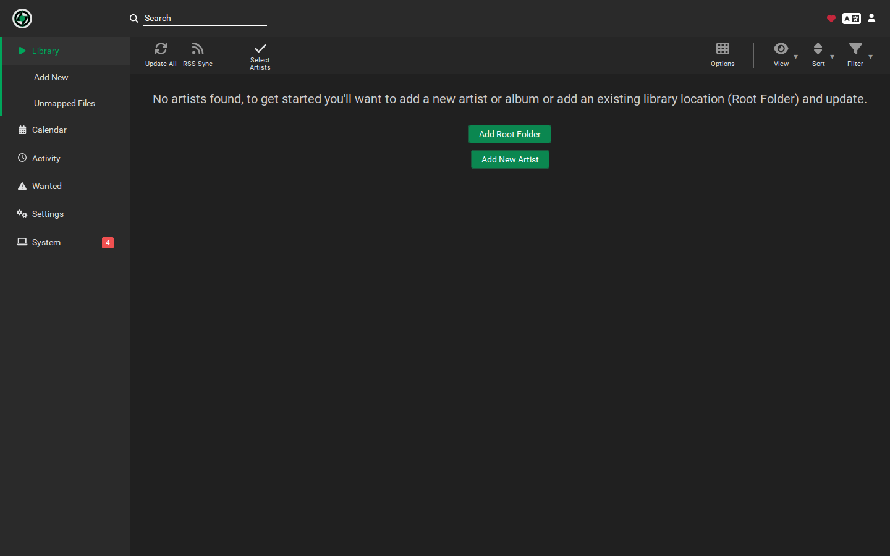
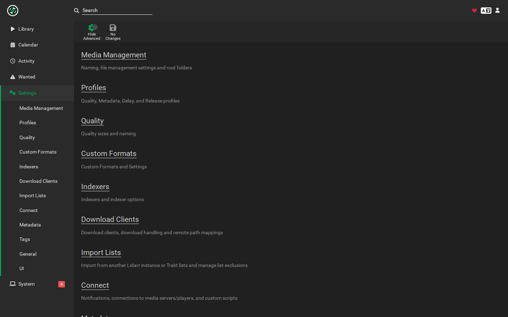
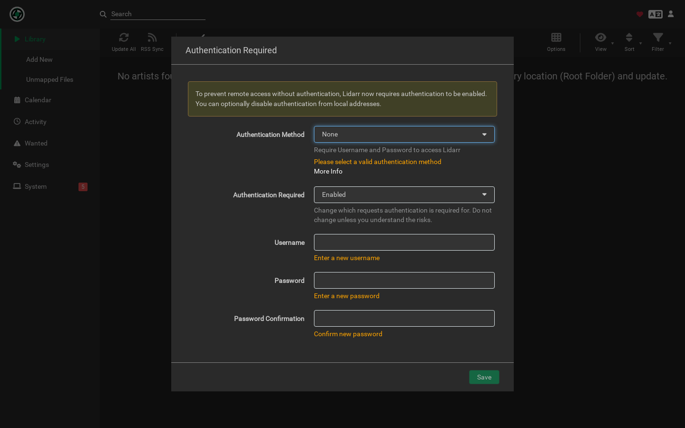

# Brainarr

Local-first AI recommendations for Lidarr. Cloud providers are optional.
Requires Lidarr 2.14.2.4786+ on the plugins/nightly branch.

Latest release: **v1.3.1**

Discover albums with deterministic, local-first AI. Pick a provider (local or cloud), set budgets, and get reproducible, high-signal recommendations.

## Installing from Releases

There are two ways to install Brainarr:

1. From the Latest release page (recommended)

- Go to GitHub Releases and download the ZIP asset for the latest version (currently v1.3.1).
- Extract the contents into Lidarr’s plugins directory:
  - Docker: `/config/plugins/RicherTunes/Brainarr/`
  - Linux: `/var/lib/lidarr/plugins/RicherTunes/Brainarr/`
  - Windows: `%ProgramData%\\Lidarr\\plugins\\RicherTunes\\Brainarr\\`
- Restart Lidarr, then add Brainarr under Settings → Import Lists.

1. Using the moving tag "latest"

- The repository maintains a tag named `latest` that points to the newest stable tag (presently v1.3.1). Any automation that follows
eleases/latest will pick up the most recent stable build automatically when we publish a new version.

Notes

- Brainarr requires Lidarr 2.14.2.4786+ on the plugins/nightly branch. Our CI extracts assemblies from the plugins Docker image to validate compatibility.
- The packaged manifest.json is included in the ZIP so Lidarr recognizes the plugin in the Installed list after manual installs.

## Upgrade Notes: 1.3.0

- Deterministic planning and caching: sampling-shape defaults moved to configuration; planner and renderer got stable hashing and ordering. Caches invalidate on trim or fingerprint changes.
- Safer timeouts and resilience: provider calls enforce per-request budgets; retries tuned and logged.
- Docs and provider matrix refreshed; see full details in the 1.3.0 entry of CHANGELOG.

See CHANGELOG.md for the complete 1.3.0 list.

## Screenshots

- Landing

  

- Settings (provider, model, timeouts, budgets)

  

- Import Lists (search Brainarr)

  

- Recommendations (result list)

  

## Contents

- [What is Brainarr](#what-is-brainarr)
- [Quickstart](#quickstart)
- [Configuration](#configuration)
- [Provider compatibility](#provider-compatibility)
- [Upgrade Notes: 1.3.0](#upgrade-notes-130)
- [Troubleshooting](#troubleshooting)
- [Contributing](#contributing)

## What is Brainarr

Brainarr is an import list plugin that enriches Lidarr with AI-assisted album discovery while staying inside Lidarr’s import-list workflow.

It leans on a local-first stance by default—install the plugin, point it at your Lidarr nightly instance, and you can start running recommendations without sending prompts off-box. See the [configuration guide](./docs/configuration.md) for the full option set.

Prompt planning follows a deterministic pipeline. We fingerprint your library, select representative styles, sample artists/albums, and hand off to the renderer; the [planner & cache deep dive](./docs/planner-and-cache.md) walks through each stage.

A fingerprinted LRU cache with a sliding TTL keeps recent plans warm. When you change styles or a fingerprint shifts, the cache invalidates automatically—details and tuning live in the same [planner & cache guide](./docs/planner-and-cache.md).

Token budgeting uses a registry-plus-tokenizer model. When a tokenizer is missing we fall back to an estimator, emit a one-time warning, and log `tokenizer.fallback`; learn how to tighten drift in [tokenization & estimates](./docs/tokenization-and-estimates.md).

Telemetry is built in: metrics such as `prompt.plan_cache_*`, `prompt.headroom_violation`, and tokenizer fallbacks surface in Lidarr’s Prometheus endpoint. The [metrics reference](./docs/METRICS_REFERENCE.md) and [troubleshooting](./docs/troubleshooting.md) explain how to interpret them.

Out of the box Brainarr stays purely local through Ollama/LM Studio, including iterative refinement defaults that backfill sparse runs. If you opt into cloud providers, they share the same configuration surface—see [configuration](./docs/configuration.md) for how to enable each one.

Cloud integrations (OpenAI, Anthropic, Gemini, Perplexity, Groq, DeepSeek, OpenRouter) inherit the same guardrails: optional by design, API key redaction, and planner headroom enforcement. Provider availability and notes remain single-sourced via the generated [provider matrix](./docs/PROVIDER_MATRIX.md).

Setup scripts (`setup.ps1` / `setup.sh`) fetch Lidarr nightly assemblies, build the plugin against real binaries, and keep `LIDARR_PATH` consistent. For a full bootstrap and local workflows, see [BUILD.md](./BUILD.md) and [DEVELOPMENT.md](./DEVELOPMENT.md).

Documentation guardrails—`scripts/sync-provider-matrix.ps1`, `scripts/check-docs-consistency.ps1` / `scripts/check-docs-consistency.sh`, and markdown lint/link checks—keep README, docs, and wiki in sync. Contributors can follow the workflow outlined in [CONTRIBUTING.md](./CONTRIBUTING.md).

Release cadence is captured in the [changelog](CHANGELOG.md) and per-release notes under `docs/release-notes/`; the latest milestone summary is in [docs/release-notes/v1.3.0.md](./docs/release-notes/v1.3.0.md).

For day-to-day operations, start with the [upgrade notes](./docs/upgrade-notes-1.3.0.md) and [troubleshooting playbook](./docs/troubleshooting.md). The wiki now stubs back to these canonical docs so every surface references the same truth.

## Quickstart

1. Confirm Lidarr is on the nightly branch at version 2.14.2.4786 or newer by visiting `Settings → General → Updates`.
2. If needed, switch the branch to nightly and allow Lidarr to download the update.
3. Restart Lidarr after the nightly update finishes installing.
4. Download the Brainarr v1.3.1 release archive from GitHub.
5. Extract the archive to a temporary working directory.
6. Copy the `RicherTunes/Brainarr` folder from the archive into your Lidarr plugins directory.
7. On Windows, verify the folder now lives at `C:\ProgramData\Lidarr\plugins\RicherTunes\Brainarr`.
8. On Linux, verify the folder now lives at `/var/lib/lidarr/plugins/RicherTunes/Brainarr`.
9. On macOS, verify the folder now lives at `~/Library/Application Support/Lidarr/plugins/RicherTunes/Brainarr`.
10. Confirm the folder contains `plugin.json`, `manifest.json`, and `Brainarr.Plugin.dll`.
11. Restart Lidarr so it loads the updated plugin binaries.
12. Open Lidarr and visit `Settings → Plugins` to confirm Brainarr is listed as enabled.
13. Navigate to `Settings → Import Lists` and click `+` to add a new list.
14. Select `Brainarr AI Music Discovery` from the available list types.
15. Provide a descriptive name for the list (for example `Brainarr Recommendations`).
16. Leave the `Enable` toggle on to keep the list active after creation.
17. Verify the `AI Provider` defaults to `Ollama`, the local-first choice.
18. Ensure your Ollama service is running on `http://localhost:11434`.
19. Pull the `qwen2.5:latest` model in Ollama if it is not already installed (`ollama pull qwen2.5`).
20. Click `Test` in the Brainarr settings panel and wait for the success message.
21. If the test fails, review `System → Logs` for provider connection errors and correct the URL or model.
22. Leave cloud providers disabled to keep the local-first default until you intentionally opt in.
23. Check that `Max Recommendations` remains at the default value of 20.
24. Confirm `Discovery Mode` is set to `Adjacent` to favor related library neighbors.
25. Keep `Sampling Strategy` at `Balanced` for even style coverage.
26. Leave iterative refinement enabled so Brainarr can top up sparse results automatically.
27. Review the `Plan Cache Capacity` (default 256) and adjust only if your environment requires a different size.
28. Review the `Plan Cache TTL (minutes)` (default 5) and adjust only if your library changes extremely quickly.
29. Click `Save` to persist the configuration.
30. Back on the Import Lists overview, click `Run Now` to trigger the first Brainarr discovery.
31. Watch `System → Logs` for `Plan cache configured` and `prompt.plan_cache_*` entries that confirm the planner is active.
32. Note any `tokenizer.fallback` warnings so you can add accurate tokenizers later.
33. Open `Activity → Import Lists` to inspect the generated recommendations.
34. Approve or reject the suggested albums according to your collection policy.
35. Expose Lidarr’s metrics endpoint and scrape `prompt.plan_cache_*` and `tokenizer.fallback` if you monitor Brainarr centrally.
36. Bookmark [docs/upgrade-notes-1.3.0](./docs/upgrade-notes-1.3.0.md) and [docs/troubleshooting](./docs/troubleshooting.md) so your team shares the canonical guidance.

## Configuration

The Brainarr configuration surface covers provider selection, planner and cache tuning, and tokenization controls. See the [configuration guide](./docs/configuration.md) for defaults, rationale, and links to the tokenization and planner deep dives. Keep in mind that local providers stay enabled by default and cloud providers remain opt-in.

## Documentation map

Use these focused guides when you need more than the README overview. Each link points at the canonical source in `docs/` so the README stays concise.

- [Configuration & provider setup](./docs/configuration.md) — enable local-first defaults, wire up optional cloud providers, and learn the required tokens/script prerequisites.
- [Planner & cache deep dive](./docs/planner-and-cache.md) — understand plan fingerprints, cache TTL behaviour, and deterministic ordering guarantees.
- [Tokenization & estimates](./docs/tokenization-and-estimates.md) — improve tokenizer accuracy, interpret `tokenizer.fallback`, and keep headroom drift within ±15%.
- [Troubleshooting playbook](./docs/troubleshooting.md) — resolve trimmed prompts, cache confusion, or provider JSON quirks with step-by-step guidance.
- [Upgrade notes 1.3.0](./docs/upgrade-notes-1.3.0.md) — checklist for moving from 1.2.x, including new planner settings and cache metrics.
- [Release process & verification](./docs/RELEASE_PROCESS.md) — follow the release workflow, provider verification steps, and documentation sync scripts.

Developers updating docs should also run `pwsh ./scripts/sync-provider-matrix.ps1` and `bash ./scripts/check-docs-consistency.sh` so the generated tables and badges stay aligned.

## Provider compatibility

<!-- GENERATED: scripts/sync-provider-matrix.ps1 -->
<!-- PROVIDER_MATRIX_START -->
| Provider | Type | Status | Notes |
| --- | --- | --- | --- |
| LM Studio | Local | ✅ Verified in v1.3.0 | Best local reliability in 1.3.x |
| Gemini | Cloud | ✅ Verified in v1.3.0 | JSON-friendly responses |
| Perplexity | Cloud | ✅ Verified in v1.3.0 | Web-aware fallback |
| Ollama | Local | ✅ Verified in v1.3.0 | Run Brainarr entirely offline |
| OpenAI | Cloud | ⚠️ Experimental | JSON schema support; verify rate limits |
| Anthropic | Cloud | ⚠️ Experimental |  |
| Groq | Cloud | ⚠️ Experimental | Low-latency batches |
| DeepSeek | Cloud | ⚠️ Experimental | Budget-friendly option |
| OpenRouter | Cloud | ⚠️ Experimental | Gateway to many models |
<!-- PROVIDER_MATRIX_END -->

## Upgrade Notes: 1.3.0

Read the focused upgrade checklist in [docs/upgrade-notes-1.3.0.md](./docs/upgrade-notes-1.3.0.md) for planner changes, cache behaviour updates, and post-upgrade actions.

## Troubleshooting

Consult [docs/troubleshooting.md](./docs/troubleshooting.md) for symptom-driven guidance, cache reset tips, and links to tokenizer and provider diagnostics. Quick pointers:

- **Prompt shows `headroom_guard` or trims frequently** – increase the provider context window, loosen style filters, or switch to a larger local model. After adjusting, run the list once to warm the cache and watch `prompt.plan_cache_*` metrics stabilize.
- **Token counts look off** – add a model-specific tokenizer in the registry or accept the basic estimator after confirming the `tokenizer.fallback` metric fires only once per model. Track `prompt.actual_tokens` vs `prompt.tokens_pre` to confirm drift stays within the ±25% guardrail.

## Contributing

See [CONTRIBUTING.md](./CONTRIBUTING.md) for coding standards, documentation guardrails, and the required docs verification workflow before submitting a PR.
