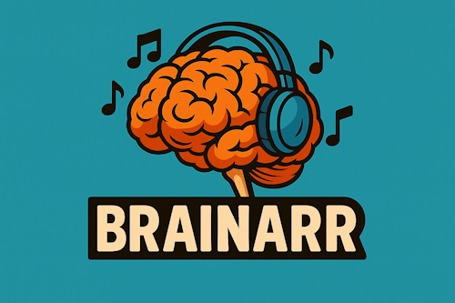
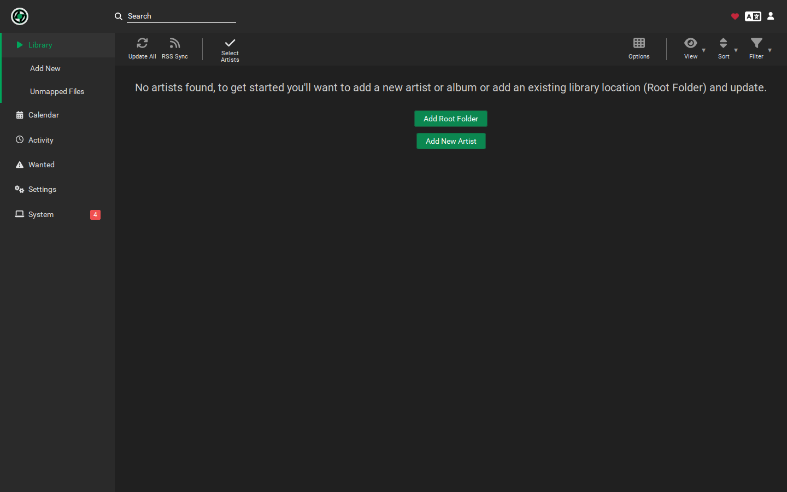
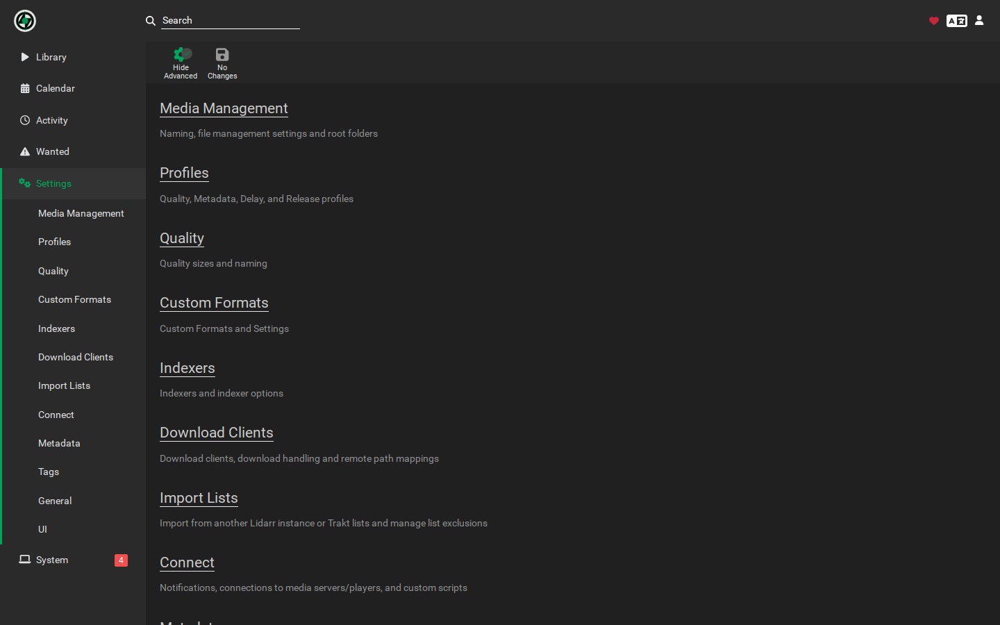
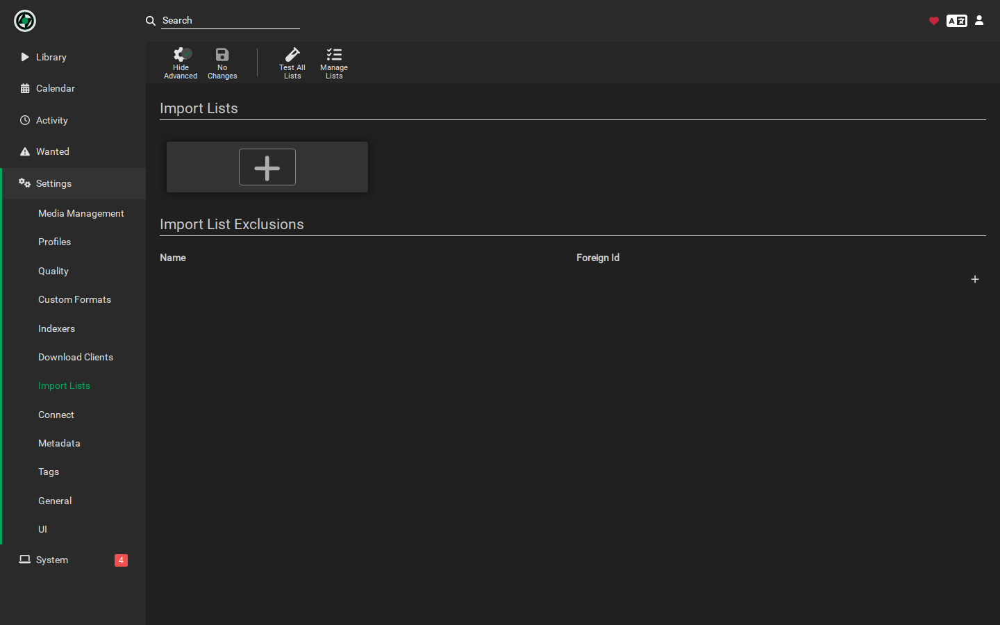
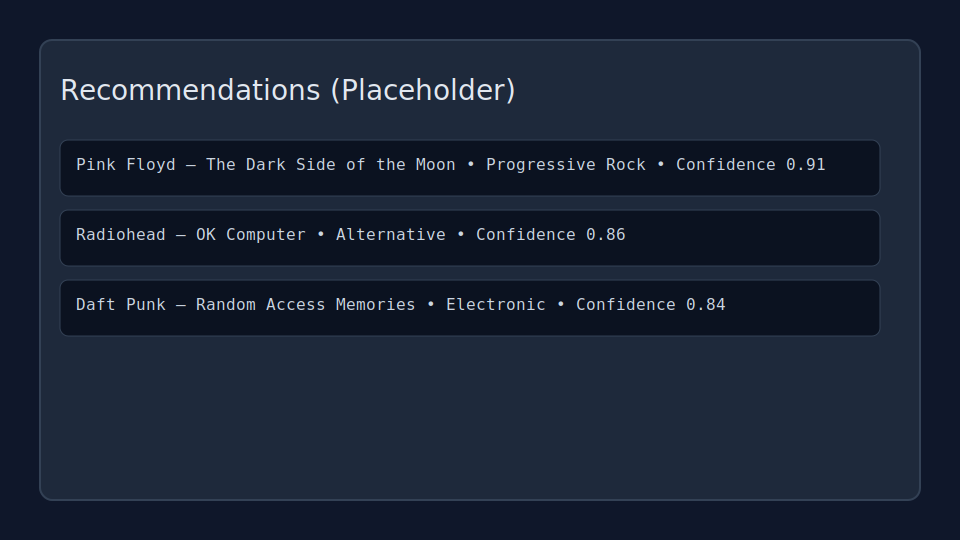

# Brainarr

Local-first AI recommendations for Lidarr. Cloud providers are optional.
Requires Lidarr 3.0.0.4855+ on the plugins/nightly branch.
[](plugin.json)

Latest release: **v1.6.1**



Discover albums with deterministic, local-first AI. Pick a provider (local or cloud), set budgets, and get reproducible, high-signal recommendations.

## Features & Capabilities

### Core

- **11 AI providers** — 2 local (Ollama, LM Studio), 7 cloud (OpenAI, Anthropic, Gemini, Perplexity, Groq, DeepSeek, OpenRouter), 2 subscription (Claude Code, OpenAI Codex).
- **Deterministic planning** — fingerprint your library, select representative styles, sample artists/albums, render prompts in a reproducible pipeline.
- **Dual recommendation modes** — specific albums or artist-only discovery.
- **Iterative refinement (top-up)** — backfill sparse results automatically until the target count is met.
- **Discovery-mode escalation** — when dedup saturation stalls top-up, the engine widens from Similar → Adjacent → Exploratory to break out of the cluster.

### Safety & Quality

- **Confidence floor (`MinConfidence`)** — drop or queue items below the threshold; parsers fabricate a default score only when the model omits one.
- **MusicBrainz enrichment** — resolve MBIDs for artists and albums; gate items missing required MBIDs.
- **Hallucination filters** — pattern-based validation (`PossiblyLegitimatePattern` list), custom substring filters, and optional strict mode.
- **Review Queue** — borderline items queue for manual approval; triage advisor scores each item with confidence band, MBID status, and dedup checks.
- **JSON salvage** — `RecommendationJsonParser` extracts valid array elements from truncated provider output, handling both bare arrays and object-wrapped shapes.

### Resilience & Performance

- **Circuit breaker** — per-provider auth-failure gates with sliding-window semantics (3 failures in 5 min → latch for 30 min).
- **Adaptive rate limiting** — per-model concurrency caps with automatic throttle decay after HTTP 429 responses.
- **Fingerprinted LRU cache** — plan cache with sliding TTL; automatic invalidation when styles or library fingerprint change.
- **Timeout-aware token budgets** — `max_tokens` scales to the configured request timeout so the output never overshoots the HTTP deadline.
- **Run cancellation** — cancellation tokens propagate through the entire top-up/enrichment chain; partial results are preserved on abort.

### Observability

- **Prometheus metrics** — `metrics/prometheus` endpoint exposes latency histograms, error counters, and 429 rates per `{provider}:{model}`.
- **Built-in Observability UI** — lightweight HTML preview under Advanced settings showing last 15 minutes of data.
- **Structured logging** — run-summary logs with attainment %, provider success, confidence-floor gate counts, and token-budget diagnostics.

### Security

- **API keys stored via Lidarr's config** — never hardcoded; Gemini suppresses host HTTP errors to prevent key-in-URL log leaks.
- **SHA256-hashed circuit keys** — raw LLM API keys never appear as dictionary keys on the heap.
- **SBOM + SHA-256 checksums** per release; v1.5.7+ also signed with Sigstore Cosign (keyless).

## Reliability & Timeouts

Brainarr avoids UI hangs by executing provider calls and tests on a dedicated thread with strict timeouts. Local defaults (Ollama/LM Studio) work entirely offline; when networked features are enabled (e.g., styles catalog refresh or cloud providers), short timeouts and retries ensure the plugin remains responsive even under provider issues.

Timeout and retry defaults

- Test timeout: 10s (connection/model checks)
- Retries: 3 attempts with backoff
- Circuit breaker: opens for 1 minute on sustained failures (half-open requires 3 successes)

Provider call timeouts (defaults)

- Ollama: 60s
- LM Studio: 60s
- OpenAI: 30s
- Anthropic: 30s
- Gemini: 30s
- Perplexity: 25s
- Groq: 20s
- OpenRouter (gateway): 45s

Notes

- Values are configurable per provider in Advanced Settings. Brainarr enforces an upper guardrail of 600 seconds (10 minutes) for any single request to accommodate slow local models.
- Local providers (Ollama/LM Studio) automatically use a 360-second (6-minute) timeout when the configured timeout is at or below the default of 30 seconds.
- For a deeper dive into timeout tuning, see the wiki's [Timeouts & Retries](./wiki-content/Timeouts-and-Retries.md) page and [docs/PERFORMANCE_TUNING.md](./docs/PERFORMANCE_TUNING.md).

## Install via Lidarr UI (recommended)

You can install Brainarr directly from Lidarr without downloading a ZIP:

1. Ensure Lidarr is on the plugins/nightly branch and at least version 3.0.0.4855 (Settings > General > Updates > Branch = nightly).
2. Go to Settings > Plugins.
3. Click Add Plugin.
4. Paste the repository URL: <https://github.com/RicherTunes/Brainarr>
5. Click Install, then Restart when prompted.
6. Go to Settings > Import Lists and add Brainarr.

## Installing from Releases

There are two ways to install Brainarr:

1. From the Latest release page (recommended)

- Go to GitHub Releases and download the ZIP asset for the latest version (currently v1.6.1).
- Extract the contents into Lidarr's plugins directory:
  - Docker: `/config/plugins/RicherTunes/Brainarr/`
  - Linux: `/var/lib/lidarr/plugins/RicherTunes/Brainarr/`
  - Windows: `%ProgramData%\Lidarr\plugins\RicherTunes\Brainarr\`
- Restart Lidarr, then add Brainarr under Settings → Import Lists.

1. Using the moving tag "latest"

- The repository maintains a tag named `latest` that points to the newest stable tag (presently v1.6.1). Any automation that follows releases/latest will pick up the most recent stable build automatically when we publish a new version.

Notes

- Brainarr requires Lidarr 3.0.0.4855+ on the plugins/nightly branch. Our CI extracts assemblies from the plugins Docker image to validate compatibility.
- The packaged manifest.json is included in the ZIP so Lidarr recognizes the plugin in the Installed list after manual installs.

For detailed Docker and manual setup instructions, see the wiki's [Installation](./wiki-content/Installation.md) page.

## Upgrade Notes: 1.3.0

- Deterministic planning and caching: sampling-shape defaults moved to configuration; planner and renderer got stable hashing and ordering. Caches invalidate on trim or fingerprint changes.
- Safer timeouts and resilience: provider calls enforce per-request budgets; retries tuned and logged.
- Docs and provider matrix refreshed; see full details in the 1.3.0 entry of CHANGELOG.

See CHANGELOG.md for the complete 1.3.0 list.

## Screenshots

- Landing

  

- Settings (provider, model, timeouts, budgets)

  

- Import Lists (search Brainarr)

  

- Recommendations (result list)

  

## Run Screenshots Locally

Generate the same PNG screenshots the CI workflow produces by spinning up a real Lidarr (plugins branch) instance with the Brainarr plugin mounted, then driving the UI with Playwright.

Prerequisites

- Docker (Linux containers)
- Node.js 18+ (prefer 20) and npm
- .NET 8 SDK

POSIX (macOS/Linux)

```bash
chmod +x scripts/snapshots/run-local.sh
scripts/snapshots/run-local.sh
# Options: --port 8765 --lidarr-tag pr-plugins-3.1.2.4913 --skip-build --wait-secs 900
```

Windows PowerShell

```powershell
./scripts/snapshots/run-local.ps1
# Parameters: -Port 8765 -LidarrTag pr-plugins-3.1.2.4913 -SkipBuild -WaitSecs 900
```

Outputs

- PNGs are written to `docs/assets/screenshots/` (landing.png, settings.png, import-lists.png, results.png).
- The container is stopped automatically when the script finishes.

Troubleshooting

- If the plugin does not appear in Lidarr, verify the mount path is exactly `/config/plugins/RicherTunes/Brainarr` and that `plugin-dist/` contains `Lidarr.Plugin.Brainarr.dll`, `plugin.json`, and `manifest.json`.
- If the UI is slow to boot on first run, increase the wait (e.g., `--wait-secs 900`).
- To debug visually, edit `scripts/snapshots/snap.mjs` and change `headless: true` to `false`.

## Contents

- [Features & Capabilities](#features--capabilities)
- [Reliability & Timeouts](#reliability--timeouts)
- [Install via Lidarr UI](#install-via-lidarr-ui-recommended)
- [Installing from Releases](#installing-from-releases)
- [Screenshots](#screenshots)
- [What is Brainarr](#what-is-brainarr)
- [Quickstart](#quickstart)
- [Configuration](#configuration)
- [Documentation](#documentation)
- [Provider compatibility](#provider-compatibility)
- [Upgrade Notes: 1.3.0](#upgrade-notes-130)
- [Troubleshooting](#troubleshooting)
- [Security](#security)
- [Shared Infrastructure](#shared-infrastructure)
- [Contributing](#contributing)

## What is Brainarr

Brainarr is an import list plugin that enriches Lidarr with AI-assisted album discovery while staying inside Lidarr's import-list workflow.

It leans on a local-first stance by default—install the plugin, point it at your Lidarr nightly instance, and you can start running recommendations without sending prompts off-box. See the [configuration guide](./docs/configuration.md) for the full option set.

Prompt planning follows a deterministic pipeline. We fingerprint your library, select representative styles, sample artists/albums, and hand off to the renderer; the [planner & cache deep dive](./docs/planner-and-cache.md) walks through each stage.

A fingerprinted LRU cache with a sliding TTL keeps recent plans warm. When you change styles or a fingerprint shifts, the cache invalidates automatically—details and tuning live in the same [planner & cache guide](./docs/planner-and-cache.md).

Token budgeting uses a registry-plus-tokenizer model. When a tokenizer is missing we fall back to an estimator, emit a one-time warning, and log `tokenizer.fallback`; learn how to tighten drift in [tokenization & estimates](./docs/tokenization-and-estimates.md).

Telemetry is built in: metrics such as `prompt.plan_cache_*`, `prompt.headroom_violation`, and tokenizer fallbacks surface in Lidarr's Prometheus endpoint. The [metrics reference](./docs/METRICS_REFERENCE.md) and [troubleshooting](./docs/troubleshooting.md) explain how to interpret them.

Out of the box Brainarr stays purely local through Ollama/LM Studio, including iterative refinement defaults that backfill sparse runs. If you opt into cloud providers, they share the same configuration surface—see [configuration](./docs/configuration.md) for how to enable each one.

Cloud integrations (OpenAI, Anthropic, Gemini, Perplexity, Groq, DeepSeek, OpenRouter) inherit the same guardrails: optional by design, API key redaction, and planner headroom enforcement. Provider availability and notes remain single-sourced via the generated [provider matrix](./docs/PROVIDER_MATRIX.md).

Setup scripts (`setup.ps1` / `setup.sh`) fetch Lidarr nightly assemblies, build the plugin against real binaries, and keep `LIDARR_PATH` consistent. For a full bootstrap and local workflows, see [BUILD.md](./BUILD.md) and [DEVELOPMENT.md](./DEVELOPMENT.md).

Documentation guardrails—`scripts/sync-provider-matrix.ps1`, `scripts/check-docs-consistency.ps1` / `scripts/check-docs-consistency.sh`, and markdown lint/link checks—keep README, docs, and wiki in sync. Contributors can follow the workflow outlined in [CONTRIBUTING.md](./CONTRIBUTING.md).

Release cadence is captured in the [changelog](CHANGELOG.md) and per-release notes under `docs/release-notes/`; the latest milestone summary is in [docs/release-notes/v1.3.0.md](./docs/release-notes/v1.3.0.md).

For day-to-day operations, start with the [upgrade notes](./docs/upgrade-notes-1.3.0.md) and [troubleshooting playbook](./docs/troubleshooting.md). The wiki now stubs back to these canonical docs so every surface references the same truth.

## Quickstart

1. Confirm Lidarr is on the nightly branch at version 3.0.0.4855 or newer by visiting `Settings → General → Updates`.
2. If needed, switch the branch to nightly and allow Lidarr to download the update.
3. Restart Lidarr after the nightly update finishes installing.
4. Download the Brainarr v1.6.1 release archive from GitHub.
5. Extract the archive to a temporary working directory.
6. Copy the `RicherTunes/Brainarr` folder from the archive into your Lidarr plugins directory.
7. On Windows, verify the folder now lives at `C:\ProgramData\Lidarr\plugins\RicherTunes\Brainarr`.
8. On Linux, verify the folder now lives at `/var/lib/lidarr/plugins/RicherTunes/Brainarr`.
9. On macOS, verify the folder now lives at `~/Library/Application Support/Lidarr/plugins/RicherTunes/Brainarr`.
10. Confirm the folder contains `plugin.json`, `manifest.json`, and `Brainarr.Plugin.dll`.
11. Restart Lidarr so it loads the updated plugin binaries.
12. Open Lidarr and visit `Settings → Plugins` to confirm Brainarr is listed as enabled.
13. Navigate to `Settings → Import Lists` and click `+` to add a new list.
14. Select `Brainarr AI Music Discovery` from the available list types.
15. Provide a descriptive name for the list (for example `Brainarr Recommendations`).
16. Leave the `Enable` toggle on to keep the list active after creation.
17. Verify the `AI Provider` defaults to `Ollama`, the local-first choice.
18. Ensure your Ollama service is running on `http://localhost:11434`.
19. Pull the `qwen2.5:latest` model in Ollama if it is not already installed (`ollama pull qwen2.5`).
20. Click `Test` in the Brainarr settings panel and wait for the success message.
21. If the test fails, review `System → Logs` for provider connection errors and correct the URL or model.
22. Leave cloud providers disabled to keep the local-first default until you intentionally opt in.
23. Check that `Max Recommendations` remains at the default value of 20.
24. Confirm `Discovery Mode` is set to `Adjacent` to favor related library neighbors.
25. Keep `Sampling Strategy` at `Balanced` for even style coverage.
26. Leave iterative refinement enabled so Brainarr can top up sparse results automatically.
27. Review the `Plan Cache Capacity` (default 256) and adjust only if your environment requires a different size.
28. Review the `Plan Cache TTL (minutes)` (default 5) and adjust only if your library changes extremely quickly.
29. Click `Save` to persist the configuration.
30. Back on the Import Lists overview, click `Run Now` to trigger the first Brainarr discovery.
31. Watch `System → Logs` for `Plan cache configured` and `prompt.plan_cache_*` entries that confirm the planner is active.
32. Note any `tokenizer.fallback` warnings so you can add accurate tokenizers later.
33. Open `Activity → Import Lists` to inspect the generated recommendations.
34. Approve or reject the suggested albums according to your collection policy.
35. Expose Lidarr's metrics endpoint and scrape `prompt.plan_cache_*` and `tokenizer.fallback` if you monitor Brainarr centrally.
36. Bookmark [docs/upgrade-notes-1.3.0](./docs/upgrade-notes-1.3.0.md) and [docs/troubleshooting](./docs/troubleshooting.md) so your team shares the canonical guidance.

For a richer walkthrough with tuning tips, see the wiki's [First Run Guide](./wiki-content/First-Run-Guide.md).

## Configuration

The Brainarr configuration surface covers provider selection, planner and cache tuning, and tokenization controls. See the [configuration guide](./docs/configuration.md) for defaults, rationale, and links to the tokenization and planner deep dives. Keep in mind that local providers stay enabled by default and cloud providers remain opt-in.

The wiki also provides focused guides:

- [Provider Setup Hub](./wiki-content/Provider-Setup.md) — pick a provider and follow the dedicated guide.
- [Local Providers](./wiki-content/Local-Providers.md) — Ollama, LM Studio, hardware tips, and smoke tests.
- [Cloud Providers](./wiki-content/Cloud-Providers.md) — API key creation, rate limits, and model selection.
- [Advanced Settings](./wiki-content/Advanced-Settings.md) — tuning discovery, confidence, sampling, strictness, and concurrency.
- [Settings Best Practices](./wiki-content/Settings-Best-Practices.md) — opinionated defaults by provider type and library size.

## Documentation

Use these focused guides when you need more than the README overview. Each link points at the canonical source so the README stays concise.

> **Note:** The GitHub Wiki mirrors these docs from `wiki-content/` and the README. Please submit edits via PRs; CI auto-publishes the wiki.

### Repo docs (`docs/`)

| Guide | What it covers |
| --- | --- |
| [Configuration & provider setup](./docs/configuration.md) | Enable local-first defaults, wire up optional cloud providers, learn required tokens/script prerequisites. |
| [Planner & cache deep dive](./docs/planner-and-cache.md) | Plan fingerprints, cache TTL behaviour, and deterministic ordering guarantees. |
| [Tokenization & estimates](./docs/tokenization-and-estimates.md) | Improve tokenizer accuracy, interpret `tokenizer.fallback`, and keep headroom drift within ±15%. |
| [Troubleshooting playbook](./docs/troubleshooting.md) | Resolve trimmed prompts, cache confusion, or provider JSON quirks with step-by-step guidance. |
| [Upgrade notes 1.3.0](./docs/upgrade-notes-1.3.0.md) | Checklist for moving from 1.2.x, including new planner settings and cache metrics. |
| [Release process & verification](./docs/RELEASE_PROCESS.md) | Follow the release workflow, provider verification steps, and documentation sync scripts. |
| [Architecture overview](./docs/ARCHITECTURE.md) | Planner flow, cache lifecycle, and component diagram. |
| [Provider guide](./docs/PROVIDER_GUIDE.md) | Per-provider model options, offline mode, and subscription provider setup. |
| [Recommendation modes](./docs/RECOMMENDATION_MODES.md) | Artist-only vs. specific albums, sampling shape, and token budget implications. |
| [Metrics reference](./docs/METRICS_REFERENCE.md) | Every metric Brainarr exposes — names, tags, meaning, and PromQL examples. |
| [Performance tuning](./docs/PERFORMANCE_TUNING.md) | Provider benchmarks, KPI targets, and optimization strategies by deployment scenario. |
| [Security best practices](./docs/SECURITY.md) | API key management, data privacy, network security, and audit guidance. |
| [API reference](./docs/API_REFERENCE.md) | Plugin action endpoints (test, fetch, observability, review queue). |
| [Testing guide](./docs/TESTING_GUIDE.md) | Unit, integration, and E2E test patterns and how to run them. |
| [Build instructions](./BUILD.md) | Full bootstrap: fetch Lidarr assemblies, build, and package. |
| [Development guide](./DEVELOPMENT.md) | Local development workflows, debugging, and IDE setup. |

Developers updating docs should also run `pwsh ./scripts/sync-provider-matrix.ps1` and `bash ./scripts/check-docs-consistency.sh` so the generated tables and badges stay aligned.

### Wiki (`wiki-content/`)

The wiki provides user-facing walk-throughs that complement the technical docs above.

| Wiki page | Focus |
| --- | --- |
| [Home](./wiki-content/Home.md) | Orientation, install quick-start, provider matrix, and link index. |
| [Start Here](./wiki-content/Start-Here.md) | Three-step onboarding checklist pointing to canonical docs. |
| [Installation](./wiki-content/Installation.md) | Detailed install and Docker setup. |
| [First Run Guide](./wiki-content/First-Run-Guide.md) | Walk-through from first config through optimization. |
| [Provider Setup](./wiki-content/Provider-Setup.md) | Hub for per-provider configuration with dedicated guides. |
| [Provider Basics](./wiki-content/Provider-Basics.md) | Quick comparisons — privacy, cost, speed. |
| [Local Providers](./wiki-content/Local-Providers.md) | Ollama, LM Studio, hardware tips, and smoke tests. |
| [Cloud Providers](./wiki-content/Cloud-Providers.md) | API keys, rate limits, model selection, and multi-provider failover. |
| [Advanced Settings](./wiki-content/Advanced-Settings.md) | Discovery, confidence, sampling, strictness, and concurrency tuning. |
| [Settings Best Practices](./wiki-content/Settings-Best-Practices.md) | Opinionated defaults by provider type and library size. |
| [Review Queue](./wiki-content/Review-Queue.md) | Triage and approval workflow for borderline recommendations. |
| [Timeouts & Retries](./wiki-content/Timeouts-and-Retries.md) | Timeout-aware budgets and retry behaviour summary. |
| [Hallucination Reduction](./wiki-content/Hallucination-Reduction.md) | Practical settings and prompts to keep local-model results grounded. |
| [Observability & Metrics](./wiki-content/Observability-and-Metrics.md) | Prometheus endpoint, metric keys, tuning playbooks, and dashboards. |
| [Operations](./wiki-content/Operations.md) | Day-0 through day-N runbook: prerequisites, first-run validation, incident response. |
| [Troubleshooting](./wiki-content/Troubleshooting.md) | Common issues and diagnostics (mirrors `docs/troubleshooting.md`). |

### Shared library — Lidarr.Plugin.Common

Brainarr is built on [Lidarr.Plugin.Common](https://github.com/RicherTunes/Lidarr.Plugin.Common). For foundation topics shared across the ecosystem:

| Common wiki page | What it covers |
| --- | --- |
| [Home](https://github.com/RicherTunes/Lidarr.Plugin.Common/blob/main/wiki/Home.md) | Project overview, quick links, and cross-plugin conventions. |
| [Architecture Overview](https://github.com/RicherTunes/Lidarr.Plugin.Common/blob/main/wiki/Architecture-Overview.md) | Plugin lifecycle, module wiring, and DI patterns. |
| [SDK and Extension Points](https://github.com/RicherTunes/Lidarr.Plugin.Common/blob/main/wiki/SDK-and-Extension-Points.md) | Interfaces and base classes for providers, bridges, and services. |
| [Shared Helpers Catalog](https://github.com/RicherTunes/Lidarr.Plugin.Common/blob/main/wiki/Shared-Helpers-Catalog.md) | Reusable utilities (caching, health, resilience, logging, security). |
| [Versioning and Submodule Pinning](https://github.com/RicherTunes/Lidarr.Plugin.Common/blob/main/wiki/Versioning-and-Submodule-Pinning.md) | How Common versions are pinned, bumped, and validated across plugins. |

## Provider compatibility

<!-- GENERATED: scripts/sync-provider-matrix.ps1 -->
<!-- PROVIDER_MATRIX_START -->
| Provider | Type | Status | Notes |
| --- | --- | --- | --- |
| LM Studio | Local | ✅ Verified in v1.3.1 | Best local reliability in 1.3.x |
| Gemini | Cloud | ✅ Verified in v1.3.1 | JSON-friendly responses |
| Perplexity | Cloud | ✅ Verified in v1.3.1 | Web-aware fallback |
| Ollama | Local | ✅ Verified in v1.3.1 | Run Brainarr entirely offline |
| OpenAI | Cloud | ⚠️ Experimental | JSON schema support; verify rate limits |
| Anthropic | Cloud | ⚠️ Experimental |  |
| Groq | Cloud | ⚠️ Experimental | Low-latency batches |
| DeepSeek | Cloud | ⚠️ Experimental | Budget-friendly option |
| OpenRouter | Cloud | ⚠️ Experimental | Gateway to many models |
| Claude Code | Subscription | ✅ Verified in v1.3.2 | Uses local Claude Code CLI credentials (~/.claude/.credentials.json) |
| OpenAI Codex | Subscription | ✅ Verified in v1.3.2 | Uses local Codex CLI credentials (~/.codex/auth.json) |
<!-- PROVIDER_MATRIX_END -->

### Tested local models

- Ollama: `qwen2.5:latest` (default) — balanced quality and speed for 1.3.x.
- Ollama: `llama3.2:latest` or `llama3.2:8b` — solid fallback with smaller footprint.

See the [Hallucination Reduction guide](./wiki-content/Hallucination-Reduction.md) for tuning tips and prompt examples.

### Provider model options

For per-provider model lists, defaults, and subscription setup, see [docs/PROVIDER_GUIDE.md](./docs/PROVIDER_GUIDE.md). Key defaults:

| Provider | Default model | Notes |
| --- | --- | --- |
| **Ollama** | `qwen2.5:latest` | Auto-detected from local instance |
| **LM Studio** | `local-model` | Auto-detected from local instance |
| **OpenAI** | `GPT41_Mini` | GPT-4.1 series available |
| **Anthropic** | `ClaudeSonnet4` | Claude 4 Sonnet |
| **Gemini** | `Gemini_25_Flash` | Gemini 2.5 Flash |
| **Groq** | `Llama33_70B_Versatile` | Low-latency inference |
| **DeepSeek** | `DeepSeek_Chat` | Budget-friendly |
| **Perplexity** | `Sonar_Pro` | Web-augmented |
| **OpenRouter** | `Auto` | Gateway to many models |

## Upgrade Notes: 1.3.0

Read the focused upgrade checklist in [docs/upgrade-notes-1.3.0.md](./docs/upgrade-notes-1.3.0.md) for planner changes, cache behaviour updates, and post-upgrade actions.

## Troubleshooting

Consult [docs/troubleshooting.md](./docs/troubleshooting.md) for symptom-driven guidance, cache reset tips, and links to tokenizer and provider diagnostics. Quick pointers:

- **Prompt shows `headroom_guard` or trims frequently** – increase the provider context window, loosen style filters, or switch to a larger local model. After adjusting, run the list once to warm the cache and watch `prompt.plan_cache_*` metrics stabilize.
- **Token counts look off** – add a model-specific tokenizer in the registry or accept the basic estimator after confirming the `tokenizer.fallback` metric fires only once per model. Track `prompt.actual_tokens` vs `prompt.tokens_pre` to confirm drift stays within the ±25% guardrail.

For additional help, the wiki provides a dedicated [Troubleshooting](./wiki-content/Troubleshooting.md) page and the [Operations](./wiki-content/Operations.md) runbook covers incident response.

## Security

- High-level security posture and threat model: see `SECURITY.md`.
- Operational guidance (keys, transports, examples): see `docs/SECURITY.md`.

Provenance

- Each tagged release publishes a software bill of materials (SBOM) and a SHA-256 checksum.
- Starting with v1.5.7, release ZIPs are also signed with Sigstore Cosign (keyless). Verify the `.sig` signature against the GitHub OIDC identity.

## Shared Infrastructure

Brainarr is built on [Lidarr.Plugin.Common](https://github.com/RicherTunes/Lidarr.Plugin.Common) — the shared library for all RicherTunes Lidarr streaming plugins.

**Key shared services consumed by Brainarr:**

- `UniversalAdaptiveRateLimiter` — adaptive rate-limiting for all HTTP calls
- `FileTokenStore<T>` — encrypted token persistence (used by parity tests)
- `AdvancedCircuitBreaker` / `ExponentialBackoffRetryPolicy` — resilience stack for provider HTTP calls
- `TokenBucketRateLimiter` / `RateLimitPresets` — per-provider request budgets
- `SmartCache<T>` — LRU-with-TTL cache backing recommendation plan storage

**Ecosystem version contract:** Brainarr tracks `commonVersion: 1.18.0-dev`. The `ecosystem-parity-lint.ps1 -Check VersionContract` gate enforces that the plugin's `VERSION` file, `plugin.json`, and the Common submodule pin all agree. See [Common's ECOSYSTEM_VERSION_CONTRACT.md](https://github.com/RicherTunes/Lidarr.Plugin.Common/blob/main/docs/ECOSYSTEM_VERSION_CONTRACT.md) for details.

## Contributing

See [CONTRIBUTING.md](./CONTRIBUTING.md) for coding standards, documentation guardrails, and the required docs verification workflow before submitting a PR.

Run the same sanity build locally as CI:

- PowerShell: `pwsh ./test-local-ci.ps1 -ExcludeHeavy`
- POSIX: `bash ./test-local-ci.sh --exclude-heavy`

## ⚠️ Disclaimer

Brainarr is an independent, open-source project developed by RicherTunes for **educational and research purposes**. It generates music recommendations using AI providers and returns them to Lidarr as import-list items; it does not download or distribute copyrighted audio.

- **Not affiliated with, authorized, or endorsed by Lidarr or any AI provider** (OpenAI, Anthropic, Google, etc.). All trademarks belong to their respective owners.
- You are responsible for complying with each AI provider's Terms of Service and for any usage costs incurred through your own API keys or subscriptions.
- Provided **"as is", without warranty of any kind; use at your own risk** (see [LICENSE](LICENSE)). The authors accept no liability for misuse or for any consequences of use.
