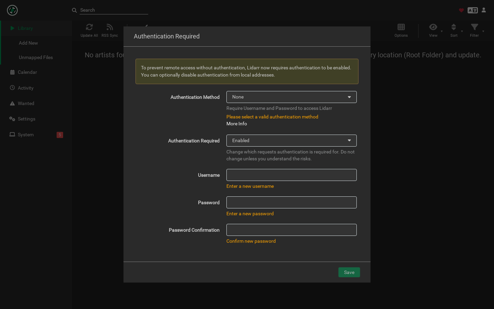

# Brainarr

Local-first AI recommendations for Lidarr. Cloud providers are optional.

[](https://github.com/RicherTunes/Brainarr/releases)
[](plugin.json)
[](https://dotnet.microsoft.com/download/dotnet/8.0)
[](https://lidarr.audio/)
[](LICENSE)

---

## Overview

**Brainarr** is an import list plugin that enriches Lidarr with AI-assisted album discovery while staying inside Lidarr's import-list workflow. It leans on a local-first stance by default—install the plugin, point it at your Lidarr nightly instance, and you can start running recommendations without sending prompts off-box.

[](https://github.com/RicherTunes/Brainarr/releases)

**Current Version**: v1.3.2 | **Last Updated**: January 2025

---

## Quick Start

### Option 1: Install via Lidarr UI (Recommended)

**Best for**: Most users, automatic updates, quickest setup

1. Ensure Lidarr is on the `plugins/nightly` branch at version `2.14.2.4786` or newer
   - Go to **Settings > General > Updates**
   - Set **Branch** to `nightly`
   - Update if needed and restart Lidarr
2. Go to **Settings > Plugins**
3. Click **Add Plugin**
4. Paste the repository URL: `https://github.com/RicherTunes/Brainarr`
5. Click **Install**, then **Restart** when prompted
6. Configure in **Settings > Import Lists**

### Option 2: Manual Installation

**Best for**: Specific versions, offline installation, manual control

1. **Download the latest release**:
   ```bash
   wget https://github.com/RicherTunes/Brainarr/releases/latest/download/Brainarr.zip
   ```

   Or download manually from [GitHub Releases](https://github.com/RicherTunes/Brainarr/releases)

2. **Extract to Lidarr plugins directory**:

   **Platform-specific paths:**
   - **Docker**: `/config/plugins/RicherTunes/Brainarr/`
   - **Linux**: `/var/lib/lidarr/plugins/RicherTunes/Brainarr/`
   - **Windows**: `%ProgramData%\Lidarr\plugins\RicherTunes\Brainarr\`
   - **macOS**: `~/Library/Application Support/Lidarr/plugins/RicherTunes/Brainarr/`

3. **Restart Lidarr**

4. **Add Import List**:
   - Go to **Settings > Import Lists**
   - Click **+** and select **Brainarr AI Music Discovery**

### Verification

After installation, verify:
- [ ] Plugin appears in Lidarr's Installed Plugins list
- [ ] Plugin files are present: `plugin.json`, `manifest.json`, `Lidarr.Plugin.Brainarr.dll`
- [ ] Plugin is enabled and functional in **Settings > Import Lists**
- [ ] No errors in **System > Logs** related to the plugin

---

## Features

### Core Functionality

- **Local-First AI**: Run recommendations entirely offline with Ollama or LM Studio
- **11 AI Providers**: Choose from local (Ollama, LM Studio) or cloud options (OpenAI, Anthropic, Gemini, Perplexity, Groq, DeepSeek, OpenRouter)
- **Subscription Providers**: Use existing Claude Code CLI or OpenAI Codex CLI credentials without separate API keys
- **Deterministic Planning**: Fingerprinted LRU cache with stable hashing and ordering for reproducible results
- **Smart Discovery Modes**: Adjacent (similar artists) or Diverse (explore broadly) recommendation strategies
- **Library Profiling**: Automatic style/genre analysis with intelligent sampling

### Advanced Features

- **Provider Failover**: Automatic fallback with health monitoring and circuit breaker patterns
- **Token Budgeting**: Per-provider token management with registry-plus-tokenizer model
- **Plan Cache**: Fingerprinted LRU cache with sliding TTL (default 256 entries, 5 minutes)
- **Iterative Refinement**: Automatically backfills sparse results with additional API calls
- **Rate Limiting**: Configurable per-provider rate limits with exponential backoff
- **Music Styles Catalog**: Normalization, matching, and filtering capabilities
- **Sampling Strategies**: Balanced, Minimal, or Comprehensive library analysis

### Production Features

- **Telemetry Integration**: Prometheus metrics (`prompt.plan_cache_*`, `tokenizer.fallback`, `prompt.headroom_violation`)
- **Security**: API key redaction, secure credential storage via Lidarr's configuration system
- **Provenance**: SBOM published for each release, SHA-256 checksums provided
- **Release Signing**: ZIPs signed with Sigstore Cosign (keyless) starting with v1.3.2
- **Comprehensive Testing**: 33+ test files with integration, unit, and edge case coverage
- **Documentation Guardrails**: Automated consistency checks and provider matrix synchronization

---

## Configuration

### Required Settings

Configure via **Settings → Import Lists → Add → Brainarr AI Music Discovery**:

- **AI Provider**: Select from Ollama (local), LM Studio (local), OpenAI, Anthropic, Gemini, Perplexity, Groq, DeepSeek, OpenRouter, Claude Code (subscription), or OpenAI Codex (subscription)
- **Model Name**: Model identifier for your chosen provider
  - Ollama default: `qwen2.5:latest`
  - OpenAI example: `gpt-4o`
  - Anthropic example: `claude-3-5-sonnet-20241022`

### Optional Settings

- **Max Recommendations**: Maximum recommendations per run (default: `20`)
- **Discovery Mode**: How to explore library
  - `Adjacent` (default): Favor related library neighbors
  - `Diverse`: Explore broadly across styles
- **Sampling Strategy**: Library analysis approach
  - `Balanced` (default): Even style coverage
  - `Minimal`: Quick profiling
  - `Comprehensive`: Deep analysis
- **Enable Iterative Refinement**: Automatically top up sparse results (default: `Enabled`)
- **Plan Cache Capacity**: Number of cached plans (default: `256`)
- **Plan Cache TTL (minutes)**: Cache expiration time (default: `5`)

### Advanced Configuration

#### Timeouts & Resilience

Brainarr avoids UI hangs by executing provider calls on a dedicated thread with strict timeouts:

- **Test timeout**: 10s (connection/model checks)
- **Retries**: 3 attempts with backoff
- **Circuit breaker**: Opens for 1 minute on sustained failures (half-open requires 3 successes)

Provider call timeouts (defaults, configurable per provider):

- Ollama: 60s
- LM Studio: 60s
- OpenAI: 30s
- Anthropic: 30s
- Gemini: 30s
- Perplexity: 25s
- Groq: 20s
- OpenRouter (gateway): 45s

**Note**: Brainarr enforces an upper guardrail of 600 seconds (10 minutes) for any single request to accommodate slow local models. Local providers (Ollama/LM Studio) automatically use a 360-second (6-minute) timeout when the configured timeout is at or below the default of 30 seconds.

#### Cloud Provider Setup

For cloud providers, configure API keys in Brainarr settings:

- **OpenAI**: API key from [platform.openai.com](https://platform.openai.com)
- **Anthropic**: API key from [console.anthropic.com](https://console.anthropic.com)
- **Gemini**: API key from [makersuite.google.com](https://makersuite.google.com)
- **Perplexity**: API key from [perplexity.ai](https://perplexity.ai)
- **Groq**: API key from [groq.com](https://groq.com)
- **DeepSeek**: API key from [deepseek.com](https://deepseek.com)
- **OpenRouter**: API key from [openrouter.ai](https://openrouter.ai)

**Subscription Providers** (no separate API keys needed):
- **Claude Code**: Uses credentials from `~/.claude/.credentials.json`
- **OpenAI Codex**: Uses credentials from `~/.codex/auth.json`

**For detailed configuration**, see [Configuration Guide](docs/configuration.md) for defaults, rationale, and provider-specific setup instructions.

---

## Usage

### Typical Workflow

1. **Configure**: Add Brainarr import list and select provider
2. **Test**: Click **Test** in settings panel to verify provider connectivity
3. **Run**: Trigger discovery via **Run Now** or schedule automatic runs
4. **Monitor**: Check **Activity → Import Lists** for recommendations and **System → Logs** for metrics

### Integration Points

- **Import Lists**: Brainarr appears as a standard import list type in Lidarr
- **Metrics**: Expose Lidarr's Prometheus endpoint to scrape `prompt.plan_cache_*` and `tokenizer.fallback` metrics
- **Logs**: Check **System → Logs** for detailed operation logs and troubleshooting info
- **Settings**: Configure provider, timeouts, budgets, and discovery behavior in Import List settings

---

## Screenshots


- **Landing Page**

  

- **Settings** (provider, model, timeouts, budgets)

  

- **Import Lists** (search and configuration)

  

- **Recommendations** (result list)

  

---

## Provider Compatibility

| Provider | Type | Status | Notes |
| --- | --- | --- | --- |
| LM Studio | Local | ✅ Verified in v1.3.1 | Best local reliability in 1.3.x |
| Gemini | Cloud | ✅ Verified in v1.3.1 | JSON-friendly responses |
| Perplexity | Cloud | ✅ Verified in v1.3.1 | Web-aware fallback |
| Ollama | Local | ✅ Verified in v1.3.1 | Run Brainarr entirely offline |
| OpenAI | Cloud | ⚠️ Experimental | JSON schema support; verify rate limits |
| Anthropic | Cloud | ⚠️ Experimental | |
| Groq | Cloud | ⚠️ Experimental | Low-latency batches |
| DeepSeek | Cloud | ⚠️ Experimental | Budget-friendly option |
| OpenRouter | Cloud | ⚠️ Experimental | Gateway to many models |
| Claude Code | Subscription | ✅ Verified in v1.3.2 | Uses local Claude Code CLI credentials |
| OpenAI Codex | Subscription | ✅ Verified in v1.3.2 | Uses local Codex CLI credentials |

### Tested Local Models

- **Ollama**: `qwen2.5:latest` (default) — balanced quality and speed for 1.3.x
- **Ollama**: `llama3.2:latest` or `llama3.2:8b` — solid fallback with smaller footprint

---

## Architecture

### Design Philosophy

Brainarr follows a **local-first, privacy-respecting design** with optional cloud augmentation:

- **Privacy by Default**: Local providers don't transmit your library data outside your network
- **Reproducibility**: Deterministic planning ensures consistent recommendations across runs
- **Resilience**: Circuit breakers, retries, and health monitoring prevent cascading failures
- **Observability**: Built-in metrics and logs for production monitoring

### Key Components

- **BrainarrImportList**: Main Lidarr integration point, implements IImportList
- **AIService**: Orchestrates provider calls and recommendation generation
- **LibraryAnalyzer**: Profiles your collection to extract styles, artists, and albums
- **AIProviderFactory**: Manages provider instantiation and failover
- **ProviderRegistry**: Extensible registry for adding new AI providers
- **RecommendationCache**: Fingerprinted LRU cache for plan reuse
- **TokenBudgetManager**: Per-provider token management and estimation

### Technology Stack

- **Platform**: .NET 8.0 (Lidarr plugin framework)
- **HTTP Client**: Lidarr's IHttpClient for provider communication
- **Configuration**: Lidarr's field definition system with FluentValidation
- **Logging**: NLog integration with structured logging
- **Testing**: Comprehensive test suite (33+ test files)

**For detailed architecture**, see [Architecture Documentation](docs/ARCHITECTURE.md).

---

## Troubleshooting

### Common Issues

#### Issue: Prompt shows `headroom_guard` or trims frequently

- **Symptoms**: Recommendations are truncated, logs show headroom violations
- **Solution**:
  1. Increase the provider context window in settings
  2. Loosen style filters to reduce prompt size
  3. Switch to a larger local model with bigger context
  4. After adjusting, run the list once to warm the cache
  5. Watch `prompt.plan_cache_*` metrics stabilize

#### Issue: Token counts look inaccurate

- **Symptoms**: `tokenizer.fallback` warnings, actual vs. estimated tokens differ significantly
- **Solution**:
  1. Add a model-specific tokenizer in the registry
  2. Accept the basic estimator if drift is acceptable (±25% guardrail)
  3. Track `prompt.actual_tokens` vs `prompt.tokens_pre` to confirm drift
  4. Monitor that `tokenizer.fallback` fires only once per model

#### Issue: Provider test fails

- **Symptoms**: Test button shows error, provider connection times out
- **Solution**:
  1. Verify provider URL is correct (Ollama: `http://localhost:11434`)
  2. Check provider service is running (e.g., `ollama list`)
  3. Confirm model is installed locally (e.g., `ollama pull qwen2.5`)
  4. Review **System → Logs** for detailed error messages
  5. For cloud providers, verify API key is valid and has quota

### Debug Logging

Enable debug logging in Lidarr:
1. Go to **Settings > General**
2. Set **Log Level** to **Debug**
3. Restart Lidarr
4. Reproduce the issue
5. Check **System > Logs** for detailed output

### Getting Help

- **Documentation**: See [docs/](docs/) for detailed guides
- **Issues**: [GitHub Issues](https://github.com/RicherTunes/Brainarr/issues) - Bug reports and feature requests
- **Discussions**: [GitHub Discussions](https://github.com/RicherTunes/Brainarr/discussions) - Questions and community support
- **Wiki**: [Project Wiki](https://github.com/RicherTunes/Brainarr/wiki) - Community-maintained documentation

**Before asking for help:**
1. Check existing issues and discussions
2. Enable debug logging and gather logs
3. Include your Lidarr version and plugin version
4. Provide steps to reproduce the issue

---

## Upgrade Notes: 1.3.0

### Breaking Changes

- Sampling-shape defaults moved to configuration
- Cache behavior changes: caches now invalidate on trim or fingerprint changes

### New Features

- Deterministic planning and caching with stable hashing and ordering
- Safer timeouts: per-request budgets with tuned retries and logging
- Enhanced observability with new metrics

### Migration Steps

1. Update plugin to v1.3.0
2. Review and adjust sampling settings in configuration
3. Clear old cache if needed (automatic on fingerprint changes)
4. Monitor `prompt.plan_cache_*` metrics after first run

See [CHANGELOG.md](CHANGELOG.md) for complete version history and [docs/upgrade-notes-1.3.0.md](docs/upgrade-notes-1.3.0.md) for detailed checklist.

---

## Documentation

- [Configuration Guide](docs/configuration.md) - Enable local-first defaults, wire up optional cloud providers, and learn required tokens/script prerequisites
- [Planner & Cache Deep Dive](docs/planner-and-cache.md) - Understand plan fingerprints, cache TTL behavior, and deterministic ordering guarantees
- [Tokenization & Estimates](docs/tokenization-and-estimates.md) - Improve tokenizer accuracy, interpret `tokenizer.fallback`, and keep headroom drift within ±15%
- [Troubleshooting Playbook](docs/troubleshooting.md) - Resolve trimmed prompts, cache confusion, or provider JSON quirks with step-by-step guidance
- [Upgrade Notes 1.3.0](docs/upgrade-notes-1.3.0.md) - Checklist for moving from 1.2.x, including new planner settings and cache metrics
- [Metrics Reference](docs/METRICS_REFERENCE.md) - Comprehensive metrics documentation for monitoring
- [Provider Matrix](docs/PROVIDER_MATRIX.md) - Generated provider availability and notes

**Additional Resources:**
- [Lidarr Documentation](https://wiki.lidarr.audio/)
- [Lidarr Plugin System](https://lidarr.audio/docs/plugins)

---

## Development

### Development Setup

**Quick Start (Recommended):**
```bash
# Clone the repository
git clone https://github.com/RicherTunes/Brainarr.git
cd Brainarr

# Run setup script (Linux/macOS)
chmod +x setup.sh && ./setup.sh

# OR for Windows PowerShell
.\setup.ps1
```

**Setup scripts handle:**
- Cloning Lidarr source/dependencies
- Restoring NuGet packages
- Building the solution
- Running tests

**Manual Setup:**
```bash
# 1. Clone the repository
git clone https://github.com/RicherTunes/Brainarr.git
cd Brainarr

# 2. Get dependencies
git submodule update --init --recursive

# 3. Restore dependencies
dotnet restore

# 4. Build the solution
dotnet build --configuration Release

# 5. Run tests
dotnet test
```

### Development Commands

```bash
# Build
dotnet build --configuration Release

# Run all tests
dotnet test

# Run with coverage
dotnet test /p:CollectCoverage=true /p:CoverletOutputFormat=opencover

# Run specific test categories
dotnet test --filter Category=Integration
dotnet test --filter Category=Unit
```

### Project Structure

```
src/                          # Main plugin source
├── Brainarr.Plugin/          # Core plugin implementation
│   ├── Configuration/        # Provider settings and validation
│   ├── Services/
│   │   ├── Core/            # Orchestration services
│   │   ├── Providers/       # AI provider implementations (11 providers)
│   │   └── Support/         # Supporting services
│   └── BrainarrImportList.cs # Main Lidarr integration
ext/                          # External dependencies
├── lidarr.plugin.common/     # Shared library (submodule)
└── Lidarr/                   # Lidarr assemblies (submodule)
docs/                         # Documentation
scripts/                      # Build and utility scripts
tests/                        # Test projects
```

### Contributing

We welcome contributions! Please see [CONTRIBUTING.md](CONTRIBUTING.md) for guidelines.

**Key Points:**
- Follow existing code patterns and conventions
- Add tests for new features (unit, integration, edge cases)
- Update documentation as needed
- Submit PRs with clear descriptions
- Run `pwsh ./scripts/sync-provider-matrix.ps1` and `bash ./scripts/check-docs-consistency.sh` before submitting
- Ensure all tests pass before submitting

Run the same sanity build locally as CI:
- PowerShell: `pwsh ./test-local-ci.ps1 -ExcludeHeavy`
- POSIX: `bash ./test-local-ci.sh --exclude-heavy`

---

## Security

### Security Posture

- **No hardcoded credentials** - All credentials stored securely via Lidarr's configuration system
- **Local-first by default** - Local providers (Ollama, LM Studio) don't transmit library data
- **Input validation** - All user inputs are validated and sanitized
- **Secure token storage** - Tokens encrypted at rest when applicable
- **API key redaction** - Keys never logged or exposed in telemetry
- **Rate limiting** - Prevents API abuse and respects service limits

### Data Handling

- **Credentials**: Stored in Lidarr's secure configuration database
- **Data Privacy**: Local providers don't transmit library data; cloud providers transmit prompts and metadata only
- **Encryption**: TLS for all cloud provider communications
- **Logging**: No sensitive data logged (credentials, tokens, personal library details)

### Provenance & Integrity

- **SBOM**: Software bill of materials published for each release
- **Checksums**: SHA-256 checksums provided for all release artifacts
- **Signing**: Release ZIPs signed with Sigstore Cosign (keyless) starting with v1.3.2
- **Verification**: Verify signatures using GitHub's OIDC identity

**Verification Example:**
```bash
# Verify release signature
cosign verify-blob Brainarr.zip \
  --certificate Brainarr.zip.sig \
  --certificate-identity "https://github.com/RicherTunes/Brainarr/.github/workflows/release.yml@refs/tags/v1.3.2" \
  --certificate-oidc-issuer "https://token.actions.githubusercontent.com"
```

### Vulnerability Reporting

See [SECURITY.md](SECURITY.md) for security policy and vulnerability reporting guidelines.

---

## Run Screenshots Locally

Generate the same PNG screenshots the CI workflow produces by spinning up a real Lidarr (plugins branch) instance with the Brainarr plugin mounted, then driving the UI with Playwright.

**Prerequisites:**
- Docker (Linux containers)
- Node.js 18+ (prefer 20) and npm
- .NET 6 SDK

**POSIX (macOS/Linux):**
```bash
chmod +x scripts/snapshots/run-local.sh
scripts/snapshots/run-local.sh
# Options: --port 8765 --lidarr-tag pr-plugins-2.14.2.4786 --skip-build --wait-secs 900
```

**Windows PowerShell:**
```powershell
./scripts/snapshots/run-local.ps1
# Parameters: -Port 8765 -LidarrTag pr-plugins-2.14.2.4786 -SkipBuild -WaitSecs 900
```

**Outputs:**
- PNGs written to `docs/assets/screenshots/` (landing.png, settings.png, import-lists.png, results.png)
- Container stopped automatically when script finishes

**Troubleshooting:**
- If plugin doesn't appear, verify mount path is exactly `/config/plugins/RicherTunes/Brainarr` and `plugin-dist/` contains required files
- If UI is slow to boot, increase wait time (e.g., `--wait-secs 900`)
- To debug visually, edit `scripts/snapshots/snap.mjs` and change `headless: true` to `false`

---

## Related Plugins

This plugin is part of the RicherTunes plugin ecosystem:

- **[Tidalarr](https://github.com/RicherTunes/tidalarr)** - Tidal streaming integration for lossless audio downloads
- **[Qobuzarr](https://github.com/RicherTunes/qobuzarr)** - Qobuz streaming with ML-powered optimization
- **[AppleMusicarr](https://github.com/RicherTunes/AppleMusicarr)** - Apple Music library sync and metadata

**Shared foundation**: [Lidarr.Plugin.Common](https://github.com/RicherTunes/Lidarr.Plugin.Common)

---

## License

This project is licensed under the MIT License - see the [LICENSE](LICENSE) file for details.

### License Summary

- ✅ Commercial use allowed
- ✅ Modification allowed
- ✅ Distribution allowed
- ✅ Private use allowed
- ⚠️ Liability and warranty disclaimed

---

## Credits

### Core Contributors

- **[Brainarr Team](https://github.com/RicherTunes/Brainarr)** - Core implementation and architecture
- **Lidarr Team** - For the excellent media management platform and plugin framework

### Ecosystem

- **Lidarr** - Core music management platform
- **Ollama** - Local AI model runtime
- **LM Studio** - Local AI development environment
- **OpenAI, Anthropic, Google, Perplexity, Groq, DeepSeek, OpenRouter** - Cloud AI providers

---

## Support

- **Issues**: [GitHub Issues](https://github.com/RicherTunes/Brainarr/issues) - Bug reports and feature requests
- **Discussions**: [GitHub Discussions](https://github.com/RicherTunes/Brainarr/discussions) - Questions and community support
- **Wiki**: [Project Wiki](https://github.com/RicherTunes/Brainarr/wiki) - Community-maintained documentation

**Getting Help:**
1. Check existing issues and discussions
2. Read the documentation in `docs/`
3. Enable debug logging and gather information
4. Create a new issue with details (Lidarr version, plugin version, steps to reproduce)

---

**Current Version**: v1.3.2 | **Last Updated**: January 2025

Requires Lidarr 2.14.2.4786+ on the plugins/nightly branch.
