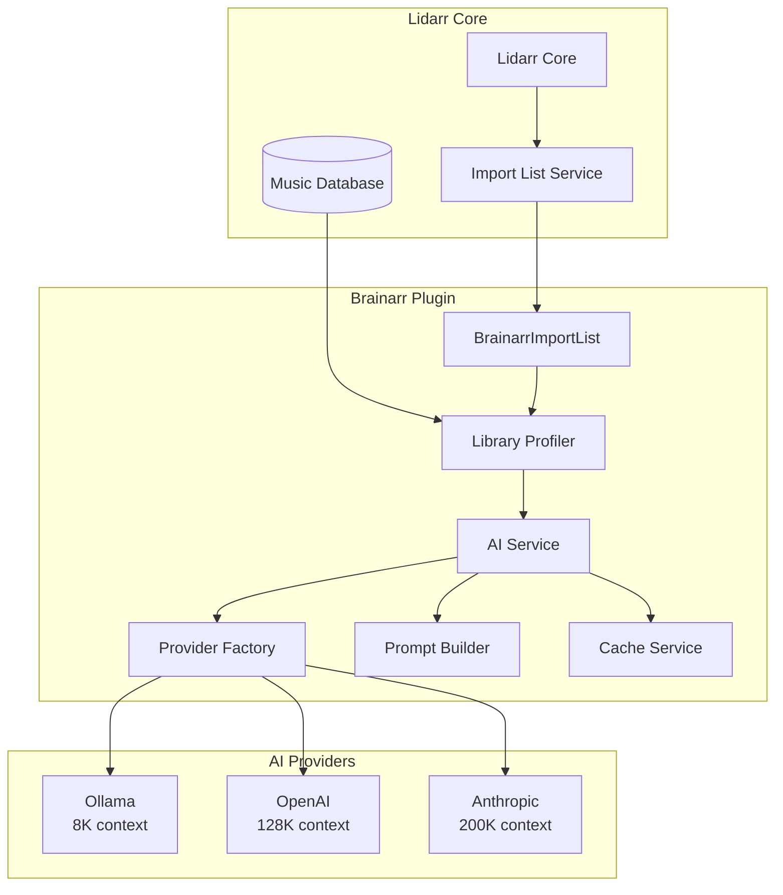
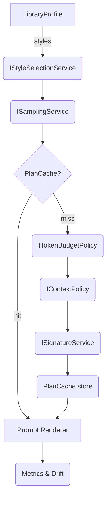

<!-- markdownlint-disable MD012 MD047 MD031 MD032 MD029 MD040 MD046 MD009 MD037 MD051 MD026 -->

# Brainarr Architecture Documentation

## Table of Contents

1. [System Overview](#system-overview)
2. [Data Flow Architecture](#data-flow-architecture)
3. [Prompt Optimization for Local Models](#prompt-optimization-for-local-models)
4. [Memory Context Management](#memory-context-management)
5. [Lidarr Integration](#lidarr-integration)
6. [Component Deep Dive](#component-deep-dive)

## System Overview

Brainarr implements a sophisticated multi-layered architecture designed to work efficiently with both local AI models (limited context) and cloud providers (larger context).



## Data Flow Architecture

### 1. Library Analysis Pipeline`r`n`r`n```mermaid

sequenceDiagram
    participant L as Lidarr
    participant B as Brainarr
    participant LP as LibraryProfiler
    participant PB as PromptBuilder
    participant AI as AI Provider

    L->>B: Fetch Recommendations
    B->>LP: Analyze Library
    LP->>L: Query Artists/Albums
    LP->>LP: Calculate Statistics
    LP->>LP: Compress Data
    LP->>PB: LibraryProfile (compressed)
    PB->>PB: Build Optimized Prompt
    PB->>AI: Send Prompt
    AI->>B: Recommendations
    B->>L: Import List Items
```

## Prompt Optimization for Local Models

Brainarr 1.3.0 modularised the prompt planner so local-first scenarios stay deterministic even as libraries grow. Instead of a monolithic builder, the pipeline is composed of small policies and services that can be tuned independently.

### Planner service stack

| Stage | Implementation | Responsibility |
| --- | --- | --- |
| Token budgeting | `ITokenBudgetPolicy` (`DefaultTokenBudgetPolicy`) | Reserve system tokens, choose completion headroom, and compute safety margins per model family. |
| Style selection | `IStyleSelectionService` (`DefaultStyleSelectionService`) | Normalise user filters, infer dominant styles, and apply relaxed-style inflation guards with absolute caps. |
| Sampling | `ISamplingService` (`DefaultSamplingService`) | Deterministically sample artists/albums based on token budget, discovery mode, and library statistics. |
| Compression policy | `ICompressionPolicy` (`DefaultCompressionPolicy`) | Define the minimum albums per group and the relaxed expansion ceiling. |
| Context heuristics | `IContextPolicy` (`DefaultContextPolicy`) | Decide how many artists/albums to target for a given budget window. |
| Signature + cache | `ISignatureService` (`DefaultSignatureService`) + `PlanCache` | Produce the stable hash seed, fingerprint, and cache key used for reuse with metrics attached. |

These components live in `NzbDrone.Core.ImportLists.Brainarr.Services.Prompting.*` and are resolved through DI so tests can swap policies without touching planner core logic.

### Execution flow



### Planner pseudo-code

```csharp
var styles = _styles.Build(profile, settings, profile.StyleContext, _compression, token);
var budget = _tokenPolicy.BuildBudget(request.ModelKey, request.ContextWindow, request.TargetTokens);
var signatures = _signature.Compose(profile, request.Artists, request.Albums, styles,
                                    settings, request.ModelKey, request.ContextWindow, budget.TargetTokens);
if (_planCache.TryGet(signatures.CacheKey, out var cached))
{
    return cached.Clone(fromCache: true);
}

var sample = _sampling.Sample(request.Artists, request.Albums, styles, settings,
                              budget.SamplingTokens, signatures.Seed, token);
var plan = PromptPlan.Create(sample, styles, signatures, budget);
_planCache.Set(signatures.CacheKey, plan, TimeSpan.FromMinutes(5));
return plan;
```

Because the sampling service receives a fixed seed from `StableId`, iterating the same library state produces identical plan outputs across machines. The cache stores up to 256 entries by default and sweeps expired entries every ten minutes to keep memory bounded.

### Relaxed style guardrails

When `RelaxStyleMatching` is enabled, the selection service:

1. Normalises the requested styles and infers dominant slugs if none are provided.
2. Expands to adjacent styles using catalog similarity scores.
3. Applies two safety gates:
   - **Inflation factor:** `expanded ≤ strict * MaxRelaxedInflation`.
   - **Absolute cap:** never exceed `AbsoluteRelaxedCap` (defaults to 5,000) expanded slugs.

If the guard triggers, the service trims extra slugs deterministically (ordinal sort) and logs the reduction. Metrics are emitted under `prompt.plan_cache_*` and `prompt.headroom_violation` so operators can observe cache churn and headroom trims.\n\n## Memory Context Management

### Token Budget Allocation

For an 8K context window model, we allocate tokens as follows:`r`n`r`n```mermaid

pie title Token Budget (8K Total)
    "System Prompt" : 500
    "Library Profile" : 2000
    "Instructions" : 500
    "JSON Schema" : 300
    "Response Buffer" : 4700
```

### Headroom guard & dynamic layout

Token budgets are enforced in two passes:

- **Initial gate**: `ITokenBudgetPolicy` supplies per-model reserves (system prompt, completion buffer, safety margin). These values reduce the tier budget before planning begins.
- **Final gate**: `LibraryAwarePromptBuilder` clamps the rendered token count to `contextWindow - headroom`. If a prompt would overflow, the builder trims sections and records `prompt.headroom_violation`.

The final invariant is:

```
estimatedTokens ≤ contextWindow - headroomTokens
```

To maintain the invariant across compression cycles, the builder re-renders until the prompt fits or marks a fallback reason:

```csharp
var maxAllowed = Math.Max(0, budget.ContextTokens - budget.HeadroomTokens);
while (estimated > Math.Min(budget.TierBudget, maxAllowed) && plan.Compression.TryCompress(plan.Sample))
{
    prompt = _renderer.Render(plan, template, token);
    estimated = tokenizer.CountTokens(prompt);
}

if (estimated > Math.Min(budget.TierBudget, maxAllowed))
{
    plan.Compression.MarkTrimmed();
    _planCache.InvalidateByFingerprint(plan.LibraryFingerprint);
    Metrics.Record("prompt.headroom_violation", 1, tags);
}

result.EstimatedTokens = Math.Min(estimated, maxAllowed);
```

Metrics emitted from this stage include:

| Metric | Meaning |
| --- | --- |
| `prompt.actual_tokens` | Final token count after compression. |
| `prompt.tokens_pre` / `prompt.tokens_post` | Baseline-versus-post compression sizes. |
| `prompt.headroom_violation` | Number of trims triggered by the guard. |
| `prompt.compression_ratio` | Drift ratio to tune safety margins. |

Operators should monitor these counters (see `docs/METRICS_REFERENCE.md`) when adjusting sampling knobs or switching providers.

## Lidarr Integration

### Import List Implementation`r`n`r`n```csharp

public class BrainarrImportList : ImportListBase<BrainarrSettings>
{
    private readonly IAIService _aiService;
    private readonly ILibraryAnalyzer _analyzer;
    private readonly ICacheService _cache;

    public override ImportListFetchResult Fetch()
    {
        // Step 1: Check cache first
        var cacheKey = GenerateCacheKey();
        var cached = _cache.Get<List<ImportListItemInfo>>(cacheKey);
        if (cached != null)
            return new ImportListFetchResult { Items = cached };

        // Step 2: Analyze current library
        var profile = _analyzer.AnalyzeLibrary(GetLibraryArtists());

        // Step 3: Get AI recommendations
        var recommendations = _aiService.GetRecommendations(profile, Settings);

        // Step 4: Convert to Lidarr format
        var items = recommendations.Select(r => new ImportListItemInfo
        {
            Artist = r.ArtistName,
            Album = r.AlbumName,
            ArtistMusicBrainzId = r.MusicBrainzId,
            ReleaseDate = GetReleaseDate(r.ReleaseYear)
        }).ToList();

        // Step 5: Cache results
        _cache.Set(cacheKey, items, TimeSpan.FromHours(Settings.CacheHours));

        return new ImportListFetchResult { Items = items };
    }
}
```

### Library Analysis Optimization`r`n`r`n```mermaid

graph TB
    subgraph "Lidarr Database Query"
        Q1[SELECT Artists]
        Q2[SELECT Albums]
        Q3[SELECT Tracks]
    end

    subgraph "In-Memory Processing"
        GC[Genre Calculation]
        AC[Artist Clustering]
        TC[Temporal Analysis]
    end

    subgraph "Compression"
        C1[Remove Duplicates]
        C2[Aggregate Statistics]
        C3[Limit Top Results]
    end

    subgraph "Profile Output"
        PO[Compressed Profile<br/>2KB JSON]
    end

    Q1 --> GC
    Q2 --> AC
    Q3 --> TC
    GC --> C1
    AC --> C2
    TC --> C3
    C1 --> PO
    C2 --> PO
    C3 --> PO
```

## Component Deep Dive

### 1. Library Profiler

**Purpose**: Efficiently extract and compress library characteristics`r`n`r`n```csharp

public class LibraryProfiler
{
    public LibraryProfile AnalyzeLibrary(List<Artist> artists)
    {
        return new LibraryProfile
        {
            // Basic counts (minimal tokens)
            TotalArtists = artists.Count,
            TotalAlbums = artists.Sum(a => a.Albums.Count),

            // Genre distribution (compressed)
            TopGenres = CalculateGenreDistribution(artists)
                .Take(10)  // Limit to top 10
                .ToList(),

            // Artist sampling (representative subset)
            TopArtists = SelectRepresentativeArtists(artists, maxCount: 20),

            // Recent activity (trend indicator)
            RecentAdditions = GetRecentAdditions(artists, days: 30, maxCount: 5)
        };
    }

    private List<ArtistInfo> SelectRepresentativeArtists(List<Artist> artists, int maxCount)
    {
        // Smart selection: Mix of popular and diverse genres
        var byPopularity = artists.OrderByDescending(a => a.Albums.Count).Take(maxCount / 2);
        var byDiversity = artists.GroupBy(a => a.Genre)
            .Select(g => g.First())
            .Take(maxCount / 2);

        return byPopularity.Union(byDiversity)
            .Take(maxCount)
            .Select(a => new ArtistInfo
            {
                Name = a.Name,
                AlbumCount = a.Albums.Count
                // Omit other fields to save tokens
            })
            .ToList();
    }
}
```

### 2. Prompt Builder Optimization

**Token Estimation Formula**:

```text

Tokens ≈ (Characters / 4) + (JSON_Overhead * 1.2)
```

**Optimization Techniques**:

1. **Field Truncation**
   ```csharp
   artist.Name.Length > 30 ? artist.Name.Substring(0, 27) + "..." : artist.Name
   ```

2. **Numerical Rounding**
   ```csharp
   percentage: Math.Round(genre.Percentage, 1)  // 45.2% instead of 45.23847%
   ```

3. **Selective Inclusion**
   ```csharp
   if (tokenBudget.Remaining > 500)
       includeArtistDetails = true;
   ```

### 3. Response Parser

**Robust JSON Extraction**:`r`n`r`n```csharp

public class ResponseParser
{
    public List<Recommendation> ParseResponse(string aiResponse)
    {
        // Handle various response formats
        var jsonStart = aiResponse.IndexOf('[');
        var jsonEnd = aiResponse.LastIndexOf(']');

        if (jsonStart >= 0 && jsonEnd > jsonStart)
        {
            var json = aiResponse.Substring(jsonStart, jsonEnd - jsonStart + 1);
            return JsonSerializer.Deserialize<List<Recommendation>>(json);
        }

        // Fallback: Try to extract individual recommendations
        return ExtractRecommendationsFromText(aiResponse);
    }
}
```

## Performance Optimizations

### 1. Caching Strategy`r`n`r`n```mermaid

graph LR
    subgraph "Cache Layers"
        L1[Memory Cache<br/>5 min TTL]
        L2[Redis Cache<br/>1 hour TTL]
        L3[Disk Cache<br/>24 hour TTL]
    end

    subgraph "Cache Keys"
        K1[library_hash]
        K2[settings_hash]
        K3[provider_id]
    end

    K1 --> L1
    K2 --> L1
    K3 --> L1
    L1 --> L2
    L2 --> L3
```

### 2. Batch Processing`r`n`r`n```csharp

public class BatchProcessor
{
    public async Task<List<Recommendation>> ProcessInBatches(
        List<LibraryProfile> profiles,
        int batchSize = 5)
    {
        var results = new ConcurrentBag<Recommendation>();

        await Parallel.ForEachAsync(
            profiles.Batch(batchSize),
            async (batch, ct) =>
            {
                var batchResults = await ProcessBatch(batch, ct);
                foreach (var result in batchResults)
                    results.Add(result);
            });

        return results.ToList();
    }
}
```

## Error Handling & Resilience

### Provider Failover Chain`r`n`r`n```mermaid

stateDiagram-v2
    [*] --> Ollama: Primary
    Ollama --> OpenAI: Failure
    Ollama --> Success: Success
    OpenAI --> Anthropic: Failure
    OpenAI --> Success: Success
    Anthropic --> Cache: Failure
    Anthropic --> Success: Success
    Cache --> Error: No Data
    Cache --> Success: Cached Data
    Success --> [*]
    Error --> [*]
```

### Circuit Breaker Implementation`r`n`r`n```csharp

public class ProviderCircuitBreaker
{
    private readonly Dictionary<string, CircuitState> _circuits = new();

    public async Task<T> ExecuteAsync<T>(string providerId, Func<Task<T>> operation)
    {
        var circuit = GetOrCreateCircuit(providerId);

        if (circuit.IsOpen)
        {
            if (DateTime.UtcNow - circuit.LastFailure < circuit.CooldownPeriod)
                throw new CircuitOpenException($"Provider {providerId} is in cooldown");

            circuit.State = CircuitState.HalfOpen;
        }

        try
        {
            var result = await operation();
            circuit.Reset();
            return result;
        }
        catch (Exception ex)
        {
            circuit.RecordFailure();
            if (circuit.FailureCount >= 3)
            {
                circuit.Open();
                _logger.LogWarning($"Circuit opened for {providerId}");
            }
            throw;
        }
    }
}
```

## Monitoring & Metrics

### Key Performance Indicators

- **Token Usage Efficiency**`r`n`r`n```text

   Efficiency = (Useful_Tokens / Total_Tokens) * 100
   Target: > 85%
```

- **Cache Hit Rate**`r`n`r`n```text

   Hit_Rate = (Cache_Hits / Total_Requests) * 100
   Target: > 60%
```

- **Provider Success Rate**`r`n`r`n```text

   Success_Rate = (Successful_Calls / Total_Calls) * 100
   Target: > 95%
```

- **Recommendation Quality Score**`r`n`r`n```text

   Quality = (Accepted_Recommendations / Total_Recommendations) * 100
   Target: > 70%
```

## Provider Architecture Evolution

### Refactored Provider Implementation

The project includes a refactored provider architecture that enhances maintainability and code reuse through inheritance patterns. The refactored providers (`*ProviderRefactored.cs`) implement a cleaner architecture with:

#### Base Provider Classes

1. **OpenAICompatibleProvider**: Base class for providers using OpenAI-compatible APIs
   - Shared implementation for OpenAI, DeepSeek, Groq, OpenRouter
   - Standardized request/response handling
   - Common authentication patterns

2. **LocalAIProvider**: Base class for local model providers
   - Shared implementation for Ollama and LM Studio
   - Auto-detection of available models
   - Unified local API communication

#### Refactored Provider Benefits

- **Code Reuse**: Common functionality extracted to base classes
- **Consistency**: Standardized error handling and retry logic
- **Maintainability**: Provider-specific logic isolated to minimal overrides
- **Extensibility**: New providers can extend base classes with minimal code

#### Implementation Example`r`n`r`n```csharp

// Refactored provider with minimal implementation
public class OpenAIProviderRefactored : OpenAICompatibleProvider
{
    protected override string ApiUrl => "https://api.openai.com/v1/chat/completions";
    public override string ProviderName => "OpenAI";
    protected override string GetDefaultModel() => "gpt-4o-mini";

    // Inherits all request/response handling from base class
}
```

## Future Optimizations

### 1. Semantic Compression

- Use embeddings to represent artist/genre relationships
- Compress similar artists into cluster representations
- Reduce prompt size by 40-50%

### 2. Incremental Updates

- Only send library changes since last analysis
- Maintain provider-side context (where supported)
- Reduce redundant data transmission

### 3. Model Fine-Tuning

- Train LoRA adapters for music recommendation
- Optimize for specific genre understanding
- Reduce prompt engineering complexity

### 4. Hybrid Approach

- Use lightweight model for initial filtering
- Use powerful model for final recommendations
- Balance cost and quality dynamically`r`n`r`n

<!-- markdownlint-disable MD012 MD047 MD031 MD032 MD029 MD040 MD046 MD009 MD037 MD051 MD026 -->
