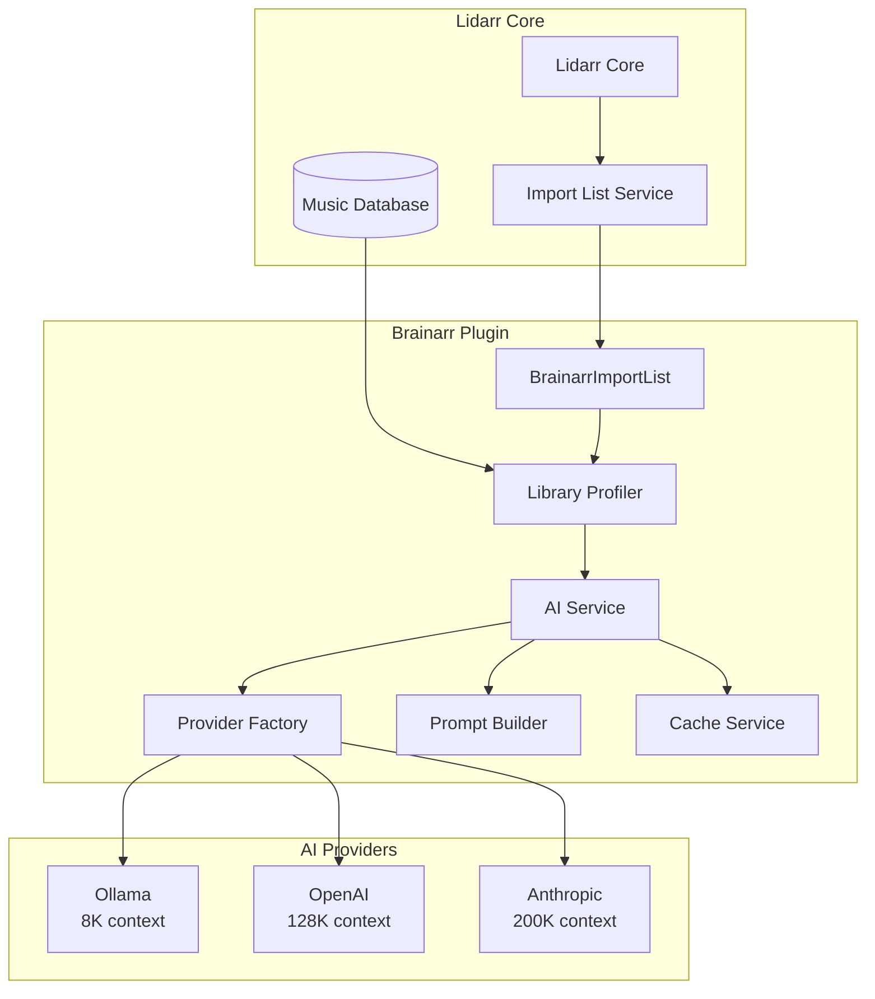
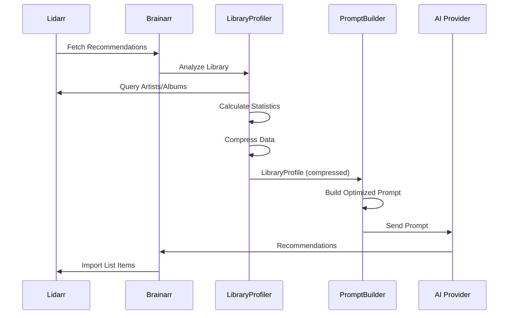
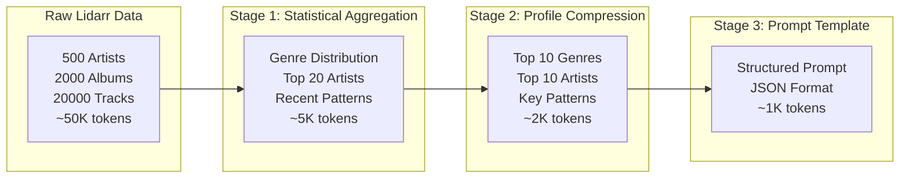
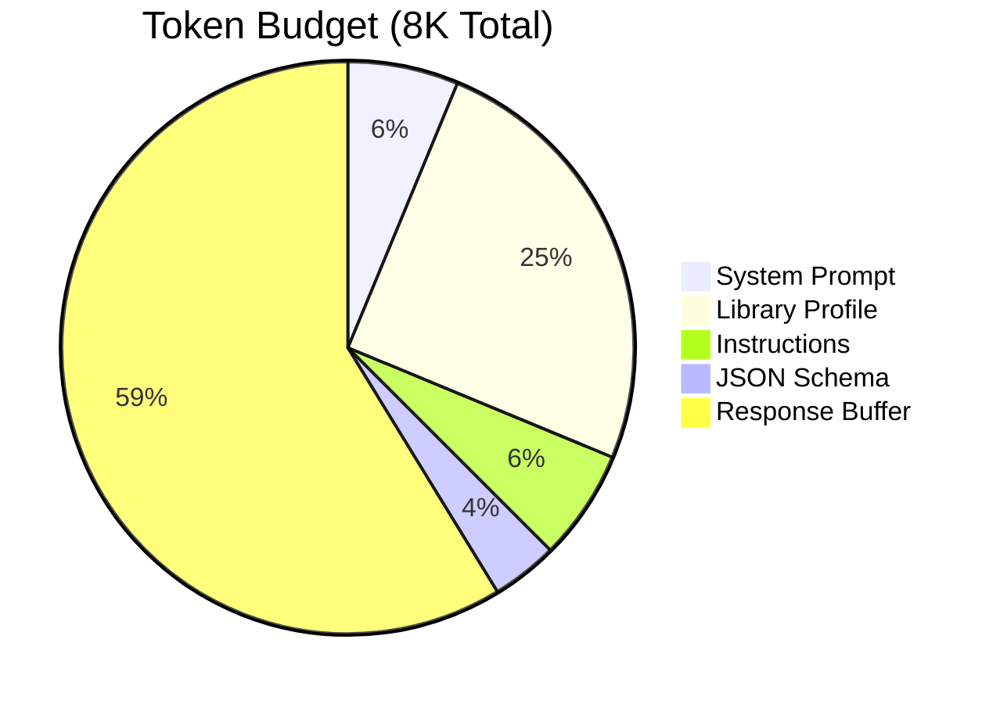
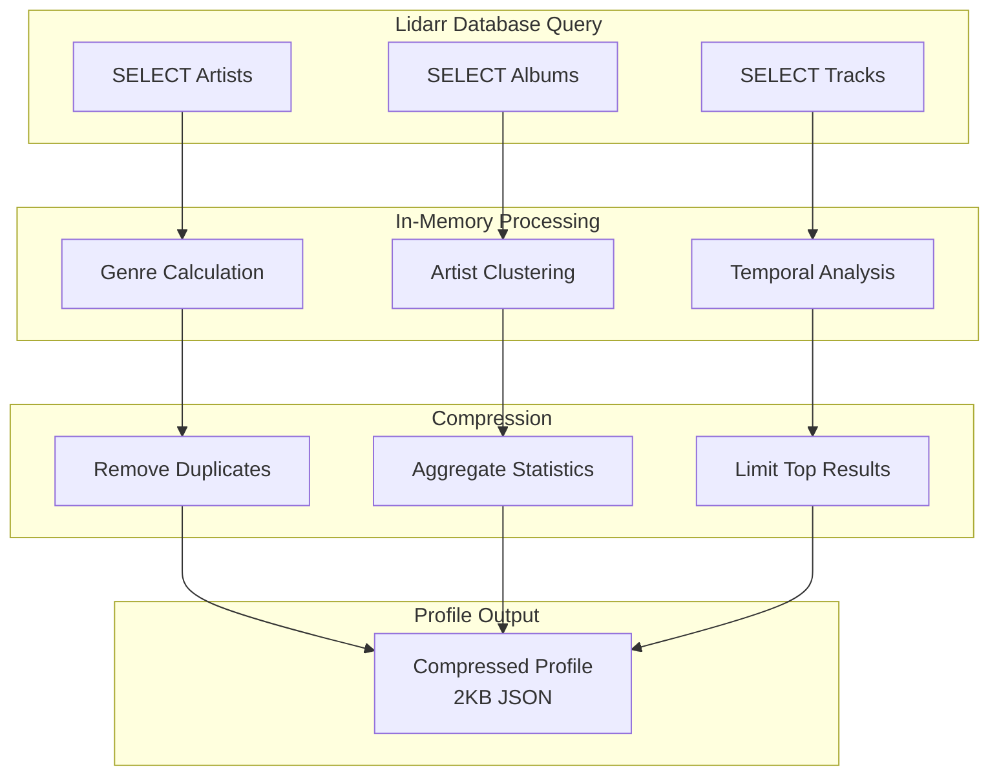
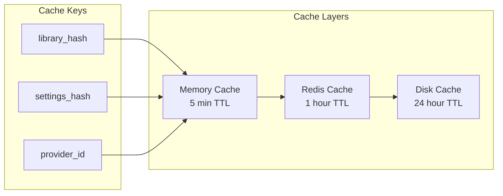
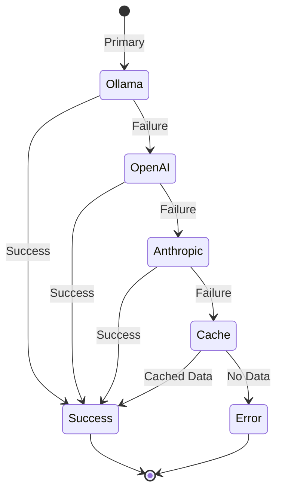

# Brainarr Architecture Documentation

## Table of Contents
1. [System Overview](#system-overview)
2. [Data Flow Architecture](#data-flow-architecture)
3. [Prompt Optimization for Local Models](#prompt-optimization-for-local-models)
4. [Memory Context Management](#memory-context-management)
5. [Lidarr Integration](#lidarr-integration)
6. [Component Deep Dive](#component-deep-dive)

## System Overview

Brainarr implements a sophisticated multi-layered architecture designed to work efficiently with both local AI models (limited context) and cloud providers (larger context).



## Data Flow Architecture

### 1. Library Analysis Pipeline



## Prompt Optimization for Local Models

### The Context Window Challenge

Local models like Ollama typically have 4K-8K token context windows, while a Lidarr library might contain:
- 500+ artists
- 2000+ albums
- 50+ genres
- Complex metadata

**Our Solution: Progressive Data Compression**

### Data Compression Strategy



### Compression Implementation

```csharp
public class LibraryProfileCompressor
{
    public CompressedProfile CompressForLocalModel(LibraryData data, int maxTokens = 2000)
    {
        // Stage 1: Statistical Aggregation
        var genreStats = CalculateGenreDistribution(data.Artists)
            .OrderByDescending(g => g.Percentage)
            .Take(10);  // Only top 10 genres
        
        // Stage 2: Artist Clustering
        var artistClusters = ClusterArtistsByGenre(data.Artists)
            .Select(c => new ArtistCluster
            {
                Genre = c.Key,
                ExampleArtists = c.Value.Take(3),  // 3 examples per genre
                Count = c.Value.Count
            });
        
        // Stage 3: Temporal Patterns
        var patterns = new TemporalPatterns
        {
            PreferredEras = GetTopEras(data.Albums, limit: 3),
            RecentTrend = AnalyzeRecentAdditions(data.Recent, days: 90)
        };
        
        return new CompressedProfile
        {
            TotalStats = new BasicStats(data),
            GenreDistribution = genreStats,
            ArtistClusters = artistClusters,
            Patterns = patterns,
            EstimatedTokens = EstimateTokenCount()
        };
    }
}
```

## Memory Context Management

### Token Budget Allocation

For an 8K context window model, we allocate tokens as follows:



### Dynamic Prompt Building

```csharp
public class DynamicPromptBuilder
{
    private const int LOCAL_MODEL_LIMIT = 2000;
    private const int CLOUD_MODEL_LIMIT = 10000;
    
    public string BuildPrompt(LibraryProfile profile, ProviderCapabilities capabilities)
    {
        var tokenLimit = capabilities.IsLocalModel ? LOCAL_MODEL_LIMIT : CLOUD_MODEL_LIMIT;
        var builder = new PromptBuilder(tokenLimit);
        
        // Priority 1: Core Statistics (Always included)
        builder.AddSection("STATS", FormatCoreStats(profile), priority: 1);
        
        // Priority 2: Genre Preferences (Critical for recommendations)
        builder.AddSection("GENRES", FormatGenres(profile.TopGenres, limit: 10), priority: 2);
        
        // Priority 3: Artist Examples (Helps with style matching)
        if (builder.HasSpace(500))
        {
            builder.AddSection("ARTISTS", FormatArtists(profile.TopArtists, limit: 20), priority: 3);
        }
        
        // Priority 4: Recent Trends (Optional enhancement)
        if (builder.HasSpace(300))
        {
            builder.AddSection("RECENT", FormatRecent(profile.RecentAdditions), priority: 4);
        }
        
        // Priority 5: Detailed Preferences (Only for cloud models)
        if (!capabilities.IsLocalModel && builder.HasSpace(1000))
        {
            builder.AddSection("DETAILS", FormatDetailedPreferences(profile), priority: 5);
        }
        
        return builder.Build();
    }
}
```

## Lidarr Integration

### Import List Implementation

```csharp
public class BrainarrImportList : ImportListBase<BrainarrSettings>
{
    private readonly IAIService _aiService;
    private readonly ILibraryAnalyzer _analyzer;
    private readonly ICacheService _cache;
    
    public override ImportListFetchResult Fetch()
    {
        // Step 1: Check cache first
        var cacheKey = GenerateCacheKey();
        var cached = _cache.Get<List<ImportListItemInfo>>(cacheKey);
        if (cached != null)
            return new ImportListFetchResult { Items = cached };
        
        // Step 2: Analyze current library
        var profile = _analyzer.AnalyzeLibrary(GetLibraryArtists());
        
        // Step 3: Get AI recommendations
        var recommendations = _aiService.GetRecommendations(profile, Settings);
        
        // Step 4: Convert to Lidarr format
        var items = recommendations.Select(r => new ImportListItemInfo
        {
            Artist = r.ArtistName,
            Album = r.AlbumName,
            ArtistMusicBrainzId = r.MusicBrainzId,
            ReleaseDate = GetReleaseDate(r.ReleaseYear)
        }).ToList();
        
        // Step 5: Cache results
        _cache.Set(cacheKey, items, TimeSpan.FromHours(Settings.CacheHours));
        
        return new ImportListFetchResult { Items = items };
    }
}
```

### Library Analysis Optimization



## Component Deep Dive

### 1. Library Profiler

**Purpose**: Efficiently extract and compress library characteristics

```csharp
public class LibraryProfiler
{
    public LibraryProfile AnalyzeLibrary(List<Artist> artists)
    {
        return new LibraryProfile
        {
            // Basic counts (minimal tokens)
            TotalArtists = artists.Count,
            TotalAlbums = artists.Sum(a => a.Albums.Count),
            
            // Genre distribution (compressed)
            TopGenres = CalculateGenreDistribution(artists)
                .Take(10)  // Limit to top 10
                .ToList(),
            
            // Artist sampling (representative subset)
            TopArtists = SelectRepresentativeArtists(artists, maxCount: 20),
            
            // Recent activity (trend indicator)
            RecentAdditions = GetRecentAdditions(artists, days: 30, maxCount: 5)
        };
    }
    
    private List<ArtistInfo> SelectRepresentativeArtists(List<Artist> artists, int maxCount)
    {
        // Smart selection: Mix of popular and diverse genres
        var byPopularity = artists.OrderByDescending(a => a.Albums.Count).Take(maxCount / 2);
        var byDiversity = artists.GroupBy(a => a.Genre)
            .Select(g => g.First())
            .Take(maxCount / 2);
        
        return byPopularity.Union(byDiversity)
            .Take(maxCount)
            .Select(a => new ArtistInfo
            {
                Name = a.Name,
                AlbumCount = a.Albums.Count
                // Omit other fields to save tokens
            })
            .ToList();
    }
}
```

### 2. Prompt Builder Optimization

**Token Estimation Formula**:
```text
Tokens ≈ (Characters / 4) + (JSON_Overhead * 1.2)
```

**Optimization Techniques**:

1. **Field Truncation**
   ```csharp
   artist.Name.Length > 30 ? artist.Name.Substring(0, 27) + "..." : artist.Name
   ```

2. **Numerical Rounding**
   ```csharp
   percentage: Math.Round(genre.Percentage, 1)  // 45.2% instead of 45.23847%
   ```

3. **Selective Inclusion**
   ```csharp
   if (tokenBudget.Remaining > 500)
       includeArtistDetails = true;
   ```

### 3. Response Parser

**Robust JSON Extraction**:

```csharp
public class ResponseParser
{
    public List<Recommendation> ParseResponse(string aiResponse)
    {
        // Handle various response formats
        var jsonStart = aiResponse.IndexOf('[');
        var jsonEnd = aiResponse.LastIndexOf(']');
        
        if (jsonStart >= 0 && jsonEnd > jsonStart)
        {
            var json = aiResponse.Substring(jsonStart, jsonEnd - jsonStart + 1);
            return JsonSerializer.Deserialize<List<Recommendation>>(json);
        }
        
        // Fallback: Try to extract individual recommendations
        return ExtractRecommendationsFromText(aiResponse);
    }
}
```

## Performance Optimizations

### 1. Caching Strategy



### 2. Batch Processing

```csharp
public class BatchProcessor
{
    public async Task<List<Recommendation>> ProcessInBatches(
        List<LibraryProfile> profiles,
        int batchSize = 5)
    {
        var results = new ConcurrentBag<Recommendation>();
        
        await Parallel.ForEachAsync(
            profiles.Batch(batchSize),
            async (batch, ct) =>
            {
                var batchResults = await ProcessBatch(batch, ct);
                foreach (var result in batchResults)
                    results.Add(result);
            });
        
        return results.ToList();
    }
}
```

## Error Handling & Resilience

### Provider Failover Chain



### Circuit Breaker Implementation

```csharp
public class ProviderCircuitBreaker
{
    private readonly Dictionary<string, CircuitState> _circuits = new();
    
    public async Task<T> ExecuteAsync<T>(string providerId, Func<Task<T>> operation)
    {
        var circuit = GetOrCreateCircuit(providerId);
        
        if (circuit.IsOpen)
        {
            if (DateTime.UtcNow - circuit.LastFailure < circuit.CooldownPeriod)
                throw new CircuitOpenException($"Provider {providerId} is in cooldown");
            
            circuit.State = CircuitState.HalfOpen;
        }
        
        try
        {
            var result = await operation();
            circuit.Reset();
            return result;
        }
        catch (Exception ex)
        {
            circuit.RecordFailure();
            if (circuit.FailureCount >= 3)
            {
                circuit.Open();
                _logger.LogWarning($"Circuit opened for {providerId}");
            }
            throw;
        }
    }
}
```

## Monitoring & Metrics

### Key Performance Indicators

1. **Token Usage Efficiency**
```text
   Efficiency = (Useful_Tokens / Total_Tokens) * 100
   Target: > 85%
   ```

2. **Cache Hit Rate**
```text
   Hit_Rate = (Cache_Hits / Total_Requests) * 100
   Target: > 60%
   ```

3. **Provider Success Rate**
```text
   Success_Rate = (Successful_Calls / Total_Calls) * 100
   Target: > 95%
   ```

4. **Recommendation Quality Score**
```text
   Quality = (Accepted_Recommendations / Total_Recommendations) * 100
   Target: > 70%
   ```

## Provider Architecture Evolution

### Refactored Provider Implementation

The project includes a refactored provider architecture that enhances maintainability and code reuse through inheritance patterns. The refactored providers (`*ProviderRefactored.cs`) implement a cleaner architecture with:

#### Base Provider Classes

1. **OpenAICompatibleProvider**: Base class for providers using OpenAI-compatible APIs
   - Shared implementation for OpenAI, DeepSeek, Groq, OpenRouter
   - Standardized request/response handling
   - Common authentication patterns

2. **LocalAIProvider**: Base class for local model providers
   - Shared implementation for Ollama and LM Studio
   - Auto-detection of available models
   - Unified local API communication

#### Refactored Provider Benefits

- **Code Reuse**: Common functionality extracted to base classes
- **Consistency**: Standardized error handling and retry logic
- **Maintainability**: Provider-specific logic isolated to minimal overrides
- **Extensibility**: New providers can extend base classes with minimal code

#### Implementation Example

```csharp
// Refactored provider with minimal implementation
public class OpenAIProviderRefactored : OpenAICompatibleProvider
{
    protected override string ApiUrl => "https://api.openai.com/v1/chat/completions";
    public override string ProviderName => "OpenAI";
    protected override string GetDefaultModel() => "gpt-4o-mini";
    
    // Inherits all request/response handling from base class
}
```

## Future Optimizations

### 1. Semantic Compression
- Use embeddings to represent artist/genre relationships
- Compress similar artists into cluster representations
- Reduce prompt size by 40-50%

### 2. Incremental Updates
- Only send library changes since last analysis
- Maintain provider-side context (where supported)
- Reduce redundant data transmission

### 3. Model Fine-Tuning
- Train LoRA adapters for music recommendation
- Optimize for specific genre understanding
- Reduce prompt engineering complexity

### 4. Hybrid Approach
- Use lightweight model for initial filtering
- Use powerful model for final recommendations
- Balance cost and quality dynamically
