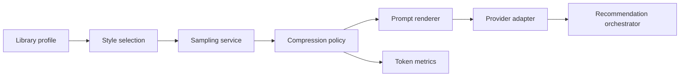
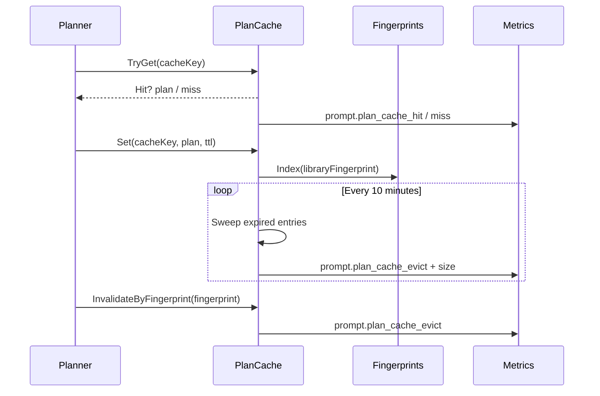

# Architecture

This overview illustrates how Brainarr''s planner and cache components collaborate. Pair it with the deeper docs for implementation details.

## Planner flow

- **Library profile** comes from the orchestrator''s analysis pipeline.
- **Style selection** and **sampling service** live in `Brainarr.Plugin/Services/Prompting/Services`.
- **Compression policy** enforces headroom and feeds token metrics.
- **Prompt renderer** creates either rich or minimal prompts before handing off to the active provider adapter.

## Cache lifecycle

- The cache stores up to 256 entries by default with a five-minute sliding TTL (`CacheSettings`).
- Fingerprint indexing means any change to the sample fingerprint purges related plans immediately.
- Metrics come from `MetricsNames` and power dashboards for cache hit rates and headroom trims.

For implementation references see `LibraryPromptPlanner.cs`, `PlanCache.cs`, `LibraryPromptRenderer.cs`, and the supporting services under `Brainarr.Plugin/Services/Prompting`.\n## Further reading\n\n- [Orchestrator blueprint](./architecture/brainarr-orchestrator-blueprint.md) – historical component breakdown\n- [Shared library integration](./architecture/shared-library-integration.md) – deeper dive into external dependencies\n- [Configuration validation tests](./architecture/configuration-validation-tests.md) – how we enforce settings consistency\n- [Source set hygiene](./architecture/source-set-hygiene.md) – legacy notes on project layout\n
