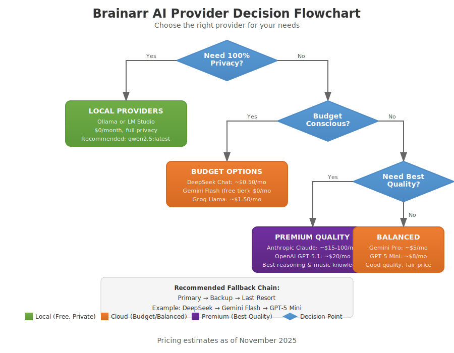

# Brainarr AI Provider Guide

Brainarr supports nine AI providers across local, cloud, and gateway modes. This guide helps you choose the right mix without duplicating the canonical reference tables.

- **Provider status, verification notes, and default models** are generated from `docs/providers.yaml` into [README ▸ Provider status](../README.md#provider-status) and `docs/PROVIDER_MATRIX.md`.
- **Deep dives and setup walkthroughs** live in the wiki: [Local Providers](https://github.com/RicherTunes/Brainarr/wiki/Local-Providers) and [Cloud Providers](https://github.com/RicherTunes/Brainarr/wiki/Cloud-Providers).
- **Troubleshooting** per provider is centralised in `docs/troubleshooting.md` and the wiki **Observability & Metrics** page.

> Compatibility
> Requires Lidarr 2.14.2.4786+ on the plugins/nightly branch (Settings > General > Updates > Branch = nightly). See the README Compatibility notice for the canonical requirement before enabling Brainarr.

## Offline mode

To stay fully offline, stick to local providers (Ollama, LM Studio), leave `BRAINARR_MODEL_REGISTRY_URL` unset, disable any model-registry refresh/backfill toggles, and confirm no fallback providers are enabled. The setup scripts populate every required assembly locally, so Brainarr can operate without network calls—watch the logs for unexpected HTTP requests when validating.

### Model options by provider

Brainarr uses UI-friendly labels that map to actual API model IDs. Select models from the dropdown in Lidarr's settings after clicking **Test** to auto-detect available options.

| Provider | Available Models | Default |
| --- | --- | --- |
| **Ollama** | Auto-detected from your local instance | `qwen2.5:latest` |
| **LM Studio** | Auto-detected from your local instance | `local-model` |
| **OpenAI** | GPT41, GPT41_Mini, GPT41_Nano, GPT4o, GPT4o_Mini, O4_Mini | `GPT41_Mini` |
| **Anthropic** | ClaudeSonnet4, Claude37_Sonnet, Claude35_Haiku, Claude3_Opus | `ClaudeSonnet4` |
| **Google Gemini** | Gemini_25_Pro, Gemini_25_Flash, Gemini_25_Flash_Lite, Gemini_20_Flash, Gemini_15_Flash, Gemini_15_Flash_8B, Gemini_15_Pro | `Gemini_25_Flash` |
| **Groq** | Llama33_70B_Versatile, Llama33_70B_SpecDec, DeepSeek_R1_Distill_L70B, Llama31_8B_Instant | `Llama33_70B_Versatile` |
| **DeepSeek** | DeepSeek_Chat, DeepSeek_Reasoner, DeepSeek_R1, DeepSeek_Search | `DeepSeek_Chat` |
| **Perplexity** | Sonar_Pro, Sonar_Reasoning_Pro, Sonar_Reasoning, Sonar | `Sonar_Pro` |
| **OpenRouter** | Auto, ClaudeSonnet4, GPT41_Mini, Gemini25_Flash, Llama33_70B, DeepSeekV3 | `Auto` |

**Advanced:** Use the **Manual Model ID** field in Advanced Settings to specify an exact API model ID (e.g., `gpt-4.1-mini`, `claude-sonnet-4-20250514`) when you need a model not in the dropdown.

## Latest models (November 2025)

AI providers frequently release new models. Here's what's current as of November 2025:

| Provider | Latest Models | API Model ID | Notes |
| --- | --- | --- | --- |
| **OpenAI** | GPT-5.1 | `gpt-5.1` | Flagship reasoning model |
| **OpenAI** | GPT-5 Mini | `gpt-5-mini` | Cost-effective, great for most uses |
| **Anthropic** | Claude Opus 4.5 | `claude-opus-4-5-20251101` | Best for complex reasoning |
| **Anthropic** | Claude Sonnet 4.5 | `claude-sonnet-4-5-20250929` | Best balance of quality/cost |
| **Anthropic** | Claude Haiku 4.5 | `claude-haiku-4-5-20251101` | Fastest, most affordable |
| **Google** | Gemini 3 Pro | `gemini-3-pro` | Preview - advanced reasoning |
| **Google** | Gemini 2.5 Flash | `gemini-2.5-flash` | Fast, generous free tier |
| **DeepSeek** | V3.2-Exp | `deepseek-chat` | Auto-upgraded, 50% cheaper than V3 |
| **DeepSeek** | R1 | `deepseek-reasoner` | Chain-of-thought reasoning |

> **Tip:** If the dropdown doesn't include the latest model, use **Manual Model ID** in Advanced Settings to specify the exact API ID.

## Cost comparison (November 2025)

Estimated monthly cost for typical Brainarr usage (~50 recommendation requests/month):

| Provider | Model | Input ($/1M) | Output ($/1M) | Est. Monthly |
| --- | --- | ---: | ---: | ---: |
| **Ollama/LM Studio** | Any local | $0 | $0 | **$0** |
| **Google Gemini** | 2.5 Flash (free tier) | $0 | $0 | **$0** |
| **DeepSeek** | Chat (V3.2) | $0.14 | $0.28 | **~$0.50** |
| **Groq** | Llama 3.3 70B | $0.59 | $0.79 | **~$1.50** |
| **Google Gemini** | 2.5 Pro | $1.25 | $5.00 | **~$5** |
| **OpenAI** | GPT-5 Mini | $1.10 | $4.40 | **~$8** |
| **Anthropic** | Sonnet 4.5 | $3.00 | $15.00 | **~$15** |
| **OpenAI** | GPT-5.1 | $5.00 | $15.00 | **~$20** |
| **Anthropic** | Opus 4.5 | $15.00 | $75.00 | **~$100** |

> **Note:** Costs vary by usage patterns. Brainarr's caching reduces API calls significantly after initial recommendations.

## Choosing your first provider

| Goal | Recommended starting point | Why |
|------|---------------------------|-----|
| 100% privacy / offline | **Ollama** or **LM Studio** | Zero-cost, no data leaves your network, great for pilots. |
| Lowest cloud spend | **DeepSeek** | Budget-friendly with strong quality; pair with free Gemini for overflow. |
| "It just works" managed cloud | **Gemini** (`Gemini_25_Flash`) | Generous free tier, excellent context window, easy onboarding. |
| Highest quality | **Anthropic** (`ClaudeSonnet4`) or via **OpenRouter** | Premium reasoning. Budget a fallback such as GPT41_Mini. |
| Fastest responses | **Groq** (`Llama33_70B_Versatile`) | Ultra-low latency for interactive playlists. |

Use the flowchart above or follow the wiki guides for detailed setup walkthroughs.

## Suggested fallback chains

These chains balance cost, stability, and performance. Configure them in Brainarr's provider settings using the UI labels shown in the matrix.

1. **Privacy First:** Ollama → LM Studio (ensure both run locally).
2. **Cost Effective:** DeepSeek (`DeepSeek_Chat`) → Gemini (`Gemini_25_Flash`) → OpenAI (`GPT41_Mini`) for overflow.
3. **Quality First:** Anthropic (`ClaudeSonnet4`) → OpenAI (`GPT41_Mini`) → DeepSeek (`DeepSeek_Chat`).
4. **Exploration:** OpenRouter (`Auto`) → Gemini (`Gemini_25_Flash`) → Groq (`Llama33_70B_Versatile`) for fast retries.

Test your fallback chain using the **Test** button after configuring each provider.

## How to update provider data

1. Edit `docs/providers.yaml` with new providers, status changes, or verification dates.
2. Run `pwsh ./scripts/sync-provider-matrix.ps1` to regenerate README, docs/PROVIDER_MATRIX.md, and the wiki fragments.
3. Commit the YAML and regenerated files together (CI enforces consistency).

## Next steps & references

- **Setup in Lidarr:** follow the [README quick start](../README.md#quick-start) then continue with [`docs/USER_SETUP_GUIDE.md`](USER_SETUP_GUIDE.md).
- **Operations & monitoring:** see `docs/troubleshooting.md` and the wiki **Observability & Metrics** page.
- **Advanced tuning:** adjust sampling and budget knobs via the Advanced Settings wiki chapter.

Keep this guide focused on decision support; if you need to add raw tables or step-by-step setup, update the wiki or `docs/providers.yaml` instead so every surface stays in sync.
