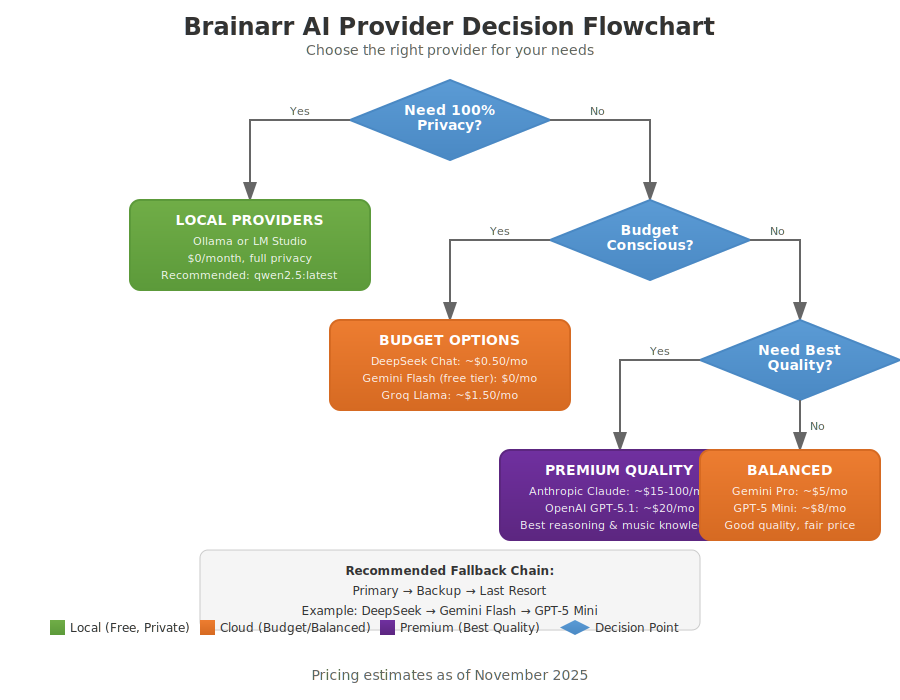

# Brainarr AI Provider Guide

Brainarr supports fourteen AI providers across local, cloud, subscription, and CLI modes. This guide helps you choose the right mix without duplicating the canonical reference tables.

- **Provider status, verification notes, and default models** are generated from `docs/providers.yaml` into [README ▸ Provider status](../README.md#provider-status) and `docs/PROVIDER_MATRIX.md`.
- **Deep dives and setup walkthroughs** live in the wiki: [Local Providers](https://github.com/RicherTunes/Brainarr/wiki/Local-Providers) and [Cloud Providers](https://github.com/RicherTunes/Brainarr/wiki/Cloud-Providers).
- **Troubleshooting** per provider is centralised in `docs/troubleshooting.md` and the wiki **Observability & Metrics** page.

> Compatibility
> See the [README compatibility notice](../README.md) for the Lidarr version requirement before enabling Brainarr.

## Offline mode

To stay fully offline, stick to local providers (Ollama, LM Studio), leave `BRAINARR_MODEL_REGISTRY_URL` unset, disable any model-registry refresh/backfill toggles, and confirm no fallback providers are enabled. The setup scripts populate every required assembly locally, so Brainarr can operate without network calls—watch the logs for unexpected HTTP requests when validating.

### Model options by provider

Brainarr uses UI-friendly labels that map to actual API model IDs. Select models from the dropdown in Lidarr's settings after clicking **Test** to auto-detect available options.

| Provider | Available Models | Default |
| --- | --- | --- |
| **Ollama** | Auto-detected from your local instance | `qwen2.5:latest` |
| **LM Studio** | Auto-detected from your local instance | `local-model` |
| **OpenAI** | GPT5, GPT5_Mini, GPT5_Nano, GPT41, GPT41_Mini, GPT41_Nano, GPT4o, GPT4o_Mini, O3_Pro, O4_Mini | `GPT5_Mini` |
| **Anthropic** | ClaudeOpus47, ClaudeSonnet46, ClaudeHaiku45, ClaudeSonnet4, Claude37_Sonnet | `ClaudeSonnet46` |
| **Google Gemini** | Gemini_3_1_Pro, Gemini_3_Flash, Gemini_3_1_Flash_Lite, Gemini_25_Pro, Gemini_25_Flash, Gemini_20_Flash | `Gemini_3_Flash` |
| **Groq** | Llama33_70B_Versatile, Llama33_70B_SpecDec, OpenAi_Gpt_Oss_120B, Groq_Compound, Qwen3_32B, DeepSeek_R1_Distill_L70B, Llama31_8B_Instant | `Llama33_70B_Versatile` |
| **DeepSeek** | DeepSeek_V4_Pro, DeepSeek_V4_Flash, DeepSeek_Chat, DeepSeek_Reasoner, DeepSeek_R1, DeepSeek_Search | `DeepSeek_V4_Flash` |
| **Perplexity** | Sonar_Pro, Sonar_Reasoning_Pro, Sonar_Reasoning, Sonar_Deep_Research, Sonar | `Sonar_Pro` |
| **OpenRouter** | Auto, ClaudeSonnet46, ClaudeOpus47, GPT5, GPT5_Mini, Gemini3_Pro, Gemini3_Flash, Llama4_Scout, DeepSeekV4 | `Auto` |
| **Z.AI GLM** | GLM_5_1, GLM_5, GLM_5_Turbo, GLM_4_7, GLM_4_6, GLM_4_5, GLM_4_5_Air, GLM_4_32B, and more | `GLM_4_5_Air` |
| **Z.AI Coding** | GLM_5_1, GLM_5, GLM_5_Turbo, GLM_4_7, GLM_4_6, GLM_4_5, GLM_4_5_Air, GLM_4_Plus, GLM_4_32B | `GLM_5_1` |
| **Claude Code** | ClaudeSonnet46, ClaudeOpus47, ClaudeHaiku45 | `ClaudeSonnet46` |
| **Claude Code CLI** | Uses `claude` binary model selection | Auto-detected |
| **OpenAI Codex** | GPT5, GPT5_Mini, GPT41_Mini | `GPT5_Mini` |

**Advanced:** Use the **Manual Model ID** field in Advanced Settings to specify an exact API model ID (e.g., `gpt-4.1-mini`, `claude-sonnet-4-20250514`) when you need a model not in the dropdown.

> **Note:** For the complete and up-to-date provider status matrix including verification notes and any additional providers, see [README ▸ Provider compatibility](../README.md#provider-compatibility).

## Latest models (November 2025)

AI providers frequently release new models. Here's what's current as of November 2025:

| Provider | Latest Models | API Model ID | Notes |
| --- | --- | --- | --- |
| **OpenAI** | GPT-5.1 | `gpt-5.1` | Flagship reasoning model |
| **OpenAI** | GPT-5 Mini | `gpt-5-mini` | Cost-effective, great for most uses |
| **Anthropic** | Claude Opus 4.5 | `claude-opus-4-5-20251101` | Best for complex reasoning |
| **Anthropic** | Claude Sonnet 4.5 | `claude-sonnet-4-5-20250929` | Best balance of quality/cost |
| **Anthropic** | Claude Haiku 4.5 | `claude-haiku-4-5-20251101` | Fastest, most affordable |
| **Google** | Gemini 3 Pro | `gemini-3-pro` | Preview - advanced reasoning |
| **Google** | Gemini 2.5 Flash | `gemini-2.5-flash` | Fast, generous free tier |
| **DeepSeek** | V3.2-Exp | `deepseek-chat` | Auto-upgraded, 50% cheaper than V3 |
| **DeepSeek** | R1 | `deepseek-reasoner` | Chain-of-thought reasoning |

> **Tip:** If the dropdown doesn't include the latest model, use **Manual Model ID** in Advanced Settings to specify the exact API ID.

## Cost comparison (November 2025)

Estimated monthly cost for typical Brainarr usage (~50 recommendation requests/month):

| Provider | Model | Input ($/1M) | Output ($/1M) | Est. Monthly |
| --- | --- | ---: | ---: | ---: |
| **Ollama/LM Studio** | Any local | $0 | $0 | **$0** |
| **Google Gemini** | 2.5 Flash (free tier) | $0 | $0 | **$0** |
| **DeepSeek** | Chat (V3.2) | $0.14 | $0.28 | **~$0.50** |
| **Groq** | Llama 3.3 70B | $0.59 | $0.79 | **~$1.50** |
| **Google Gemini** | 2.5 Pro | $1.25 | $5.00 | **~$5** |
| **OpenAI** | GPT-5 Mini | $1.10 | $4.40 | **~$8** |
| **Anthropic** | Sonnet 4.5 | $3.00 | $15.00 | **~$15** |
| **OpenAI** | GPT-5.1 | $5.00 | $15.00 | **~$20** |
| **Anthropic** | Opus 4.5 | $15.00 | $75.00 | **~$100** |

> **Note:** Costs vary by usage patterns. Brainarr's caching reduces API calls significantly after initial recommendations.

## Choosing your first provider

| Goal | Recommended starting point | Why |
|------|---------------------------|-----|
| 100% privacy / offline | **Ollama** or **LM Studio** | Zero-cost, no data leaves your network, great for pilots. |
| Lowest cloud spend | **DeepSeek** | Budget-friendly with strong quality; pair with free Gemini for overflow. |
| "It just works" managed cloud | **Gemini** (`Gemini_3_Flash`) | Generous free tier, excellent context window, easy onboarding. |
| Highest quality | **Anthropic** (`ClaudeSonnet46`) or via **OpenRouter** | Premium reasoning. Budget a fallback such as GPT5_Mini. |
| Fastest responses | **Groq** (`Llama33_70B_Versatile`) | Ultra-low latency for interactive playlists. |
| Z.AI ecosystem | **Z.AI GLM** (`GLM_4_5_Air`) or **Z.AI Coding** (`GLM_5_1`) | OpenAI- or Anthropic-compatible endpoint at api.z.ai. |

Use the flowchart above or follow the wiki guides for detailed setup walkthroughs.

## Suggested fallback chains

These chains balance cost, stability, and performance. Configure them in Brainarr's provider settings using the UI labels shown in the matrix.

1. **Privacy First:** Ollama → LM Studio (ensure both run locally).
2. **Cost Effective:** DeepSeek (`DeepSeek_V4_Flash`) → Gemini (`Gemini_3_Flash`) → OpenAI (`GPT5_Mini`) for overflow.
3. **Quality First:** Anthropic (`ClaudeSonnet46`) → OpenAI (`GPT5_Mini`) → DeepSeek (`DeepSeek_V4_Flash`).
4. **Exploration:** OpenRouter (`Auto`) → Gemini (`Gemini_3_Flash`) → Groq (`Llama33_70B_Versatile`) for fast retries.
5. **Z.AI ecosystem:** Z.AI Coding (`GLM_5_1`) → Z.AI GLM (`GLM_4_5_Air`) as PaaS fallback.

Test your fallback chain using the **Test** button after configuring each provider.

## Z.AI GLM

Z.AI GLM uses the OpenAI-compatible `chat/completions` endpoint at `api.z.ai`. It supports the GLM-5.x and GLM-4.x model families. Key points:

- **Endpoint**: `https://api.z.ai/api/paas/v4/chat/completions` (PaaS, pay-per-token).
- **Default model**: `GLM_4_5_Air` (balanced cost/quality at 106B params).
- **Temperature**: Sent (standard OpenAI format).
- **Same API key** as Z.AI Coding — only the endpoint and wire format differ.
- A Coding-Plan token used against the PaaS endpoint returns a quota-exceeded error with a hint to switch to the Coding provider.

> **Tip:** GLM-5.x reasoning models are slower (~45–60s/request). Raise **AI Request Timeout** to 60–90s or pick the faster GLM-4.5-Air (~10s) for interactive use.

## Z.AI Coding Plan

Z.AI Coding uses the Anthropic-compatible `messages` endpoint at `api.z.ai/api/anthropic`. It is billed under Z.AI's Coding Plan subscription (separate from PaaS credits).

- **Endpoint**: `https://api.z.ai/api/anthropic/v1/messages`.
- **Default model**: `GLM_5_1` (flagship, 200K context).
- **⚠️ Never enable `temperature`.** The Coding endpoint rejects any request carrying `temperature` with `[1210][Invalid API parameter]`. Brainarr omits it automatically — do not add it back.
- **Keep `max_tokens` at the default (2000).** Higher values cause GLM to pad output and overrun the request timeout, losing the entire response. Truncated responses at 2000 are recovered by Brainarr's JSON salvage parser.
- Uses a raw `HttpClient` (not Lidarr's HTTP stack) because the Coding-Plan filter requires a specific User-Agent.
- **First request after a Lidarr restart may time out** (TLS cold-start + model warm-up). It self-heals on the next sync.

> **Tip:** For reasoning models (GLM-5.x), raise **AI Request Timeout** to 60–90s. Budget ~10s for GLM-4.5-Air.

## Claude Code CLI

Claude Code CLI is an alternate Claude path that shells out to the `claude` binary rather than calling the Anthropic REST API directly. It coexists with the subscription provider (same underlying OAuth, different integration shape).

- **How it works**: Brainarr invokes `claude` on your system and lets the CLI handle authentication, transport, and response parsing.
- **Prerequisites**: Install the Claude Code CLI (`npm install -g @anthropic-ai/claude-code`) and authenticate with `claude login`.
- **When to pick it**: Use this when you want the CLI to manage auth refresh, streaming, and retries instead of the plugin. For the REST API path (no CLI dependency), use **Claude Code (Subscription)** instead.
- **No API key required** — the `claude` binary reads credentials from `~/.claude/.credentials.json` automatically.

## How to update provider data

1. Edit `docs/providers.yaml` with new providers, status changes, or verification dates.
2. Run `pwsh ./scripts/sync-provider-matrix.ps1` to regenerate README, docs/PROVIDER_MATRIX.md, and the wiki fragments.
3. Commit the YAML and regenerated files together (CI enforces consistency).

## Next steps & references

- **Setup in Lidarr:** follow the [README quick start](../README.md#quick-start) then continue with [`docs/USER_SETUP_GUIDE.md`](USER_SETUP_GUIDE.md).
- **Operations & monitoring:** see `docs/troubleshooting.md` and the wiki **Observability & Metrics** page.
- **Advanced tuning:** adjust sampling and budget knobs via the Advanced Settings wiki chapter.

Keep this guide focused on decision support; if you need to add raw tables or step-by-step setup, update the wiki or `docs/providers.yaml` instead so every surface stays in sync.
