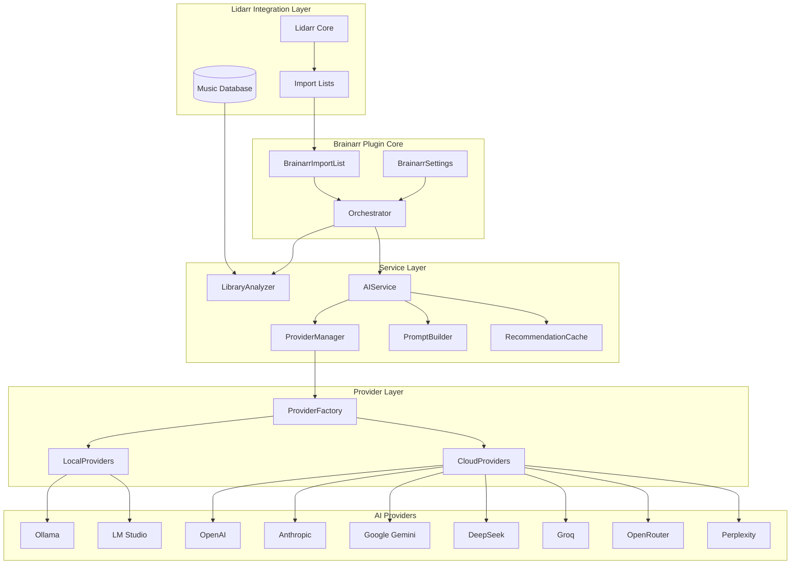
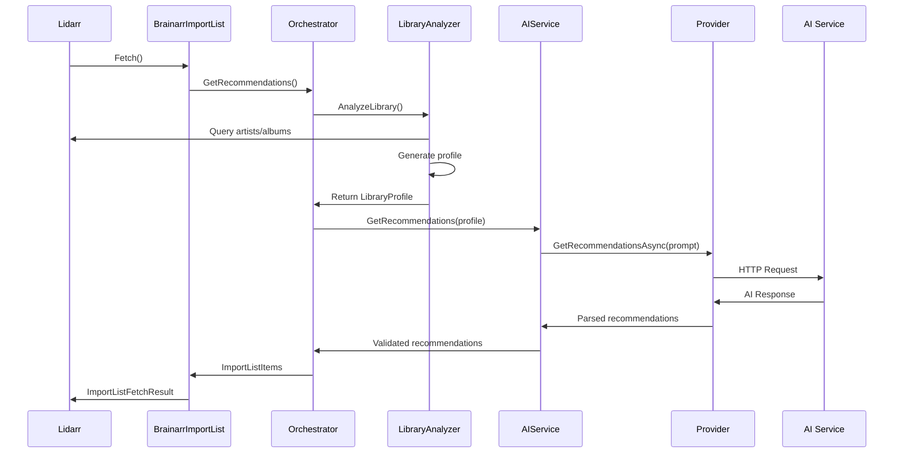
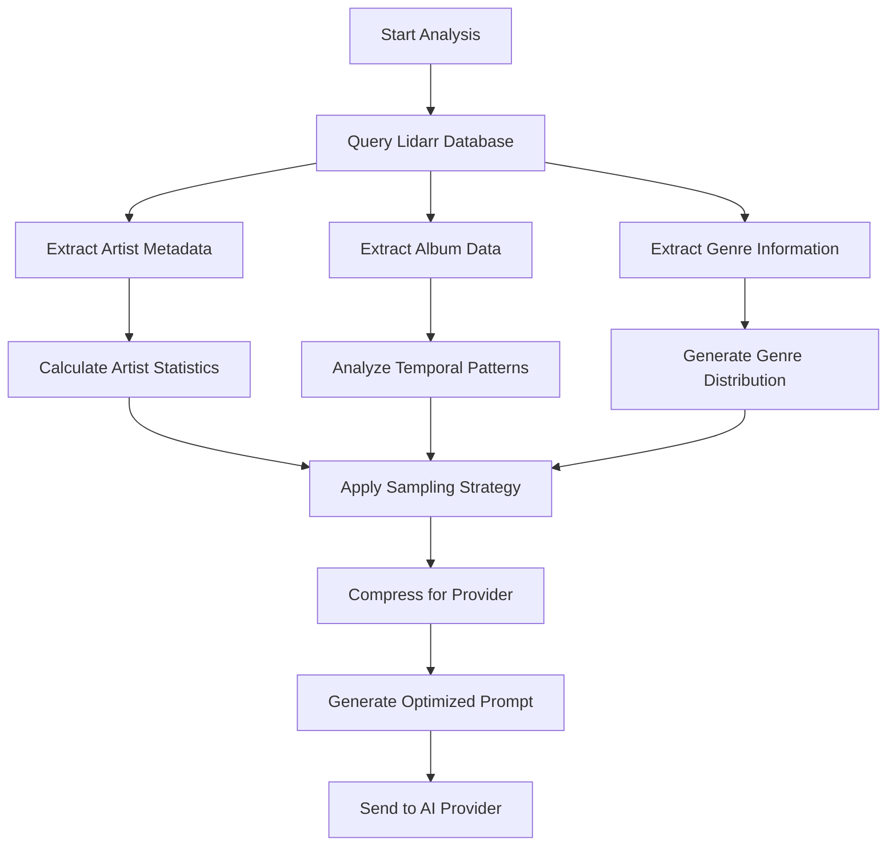
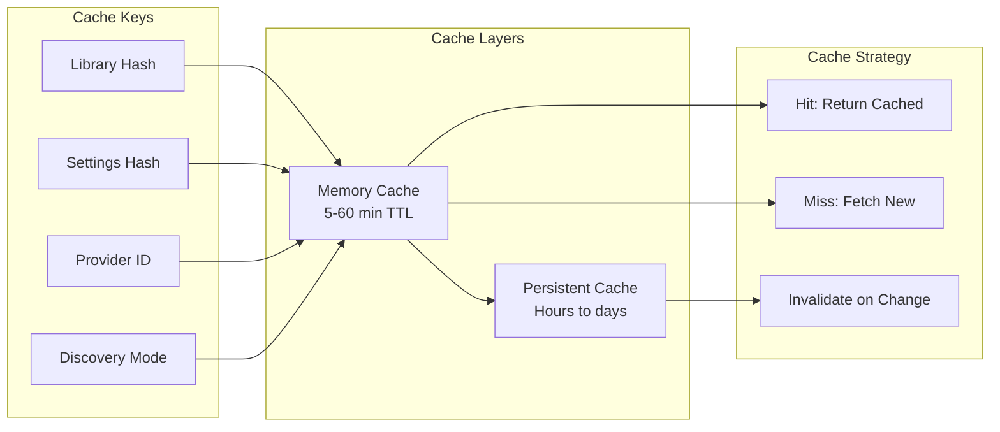

# Architecture Overview

Deep dive into Brainarr's system design, components, and technical implementation.

## System Architecture

Brainarr implements a sophisticated multi-layered architecture designed for reliability, scalability, and maintainability.



## Core Components

### 1. Plugin Integration Layer

#### BrainarrImportList
**Purpose**: Main Lidarr integration point implementing `ImportListBase`

**Responsibilities**:
- Implements Lidarr's import list contract
- Orchestrates recommendation fetching process
- Converts AI recommendations to Lidarr format
- Manages caching and error handling

**Key Methods**:
```csharp
public override ImportListFetchResult Fetch()
public override IList<ImportListItemInfo> Fetch()
public override ValidationResult Test()
```

#### BrainarrSettings  
**Purpose**: Configuration management and UI integration

**Responsibilities**:
- Defines all user-configurable settings
- Implements validation rules
- Provides dynamic UI field generation
- Manages provider-specific configurations

**Configuration Categories**:
- Basic settings (name, enabled, monitoring)
- Provider selection and authentication
- Advanced settings (caching, rate limiting)
- Debug and logging options

### 2. Core Services

#### AIService
**Purpose**: Multi-provider AI orchestration with automatic failover

**Architecture Pattern**: Chain of Responsibility
```csharp
public class AIService : IAIService
{
    private readonly SortedDictionary<int, List<IAIProvider>> _providerChain;
    private readonly IProviderHealthMonitor _healthMonitor;
    private readonly IRetryPolicy _retryPolicy;
}
```

**Key Features**:
- Provider failover chain with priorities  
- Health monitoring and circuit breaker patterns
- Rate limiting and request throttling
- Comprehensive error handling and retry logic
- Metrics collection and performance monitoring

#### LibraryAnalyzer
**Purpose**: Intelligent music library analysis and profiling

**Analysis Stages**:
1. **Data Collection**: Queries Lidarr database for artists, albums, genres
2. **Statistical Analysis**: Calculates genre distributions, temporal patterns
3. **Preference Extraction**: Identifies user preferences and listening patterns
4. **Context Compression**: Optimizes data for AI consumption

**Optimization Features**:
```csharp
public LibraryProfile AnalyzeLibrary(LibrarySamplingStrategy strategy)
{
    var profile = new LibraryProfile
    {
        TotalArtists = artists.Count,
        GenreDistribution = CalculateGenreDistribution(artists),
        TopArtists = SelectRepresentativeArtists(artists, strategy),
        TemporalPatterns = AnalyzeTemporalPatterns(albums),
        UserPreferences = ExtractUserPreferences(artists, albums)
    };
    
    return CompressForProvider(profile, providerCapabilities);
}
```

#### ProviderManager
**Purpose**: Lifecycle management for AI providers

**Responsibilities**:
- Provider instantiation and configuration
- Model auto-detection for local providers  
- Connection health monitoring
- Resource cleanup and disposal
- Configuration caching and optimization

**Provider Lifecycle**:
```csharp
public void InitializeProvider(BrainarrSettings settings)
{
    if (IsProviderCurrent(settings)) return;
    
    DisposeCurrentProvider();
    _currentProvider = _providerFactory.CreateProvider(settings);
    
    if (ShouldAutoDetect(settings))
        await AutoConfigureModel(settings);
}
```

### 3. Provider Architecture

#### IAIProvider Interface
**Contract**: Standardized interface for all AI providers
```csharp
public interface IAIProvider : IDisposable
{
    string ProviderName { get; }
    Task<bool> TestConnectionAsync();
    Task<List<string>> GetAvailableModelsAsync();
    Task<List<ImportListItemInfo>> GetRecommendationsAsync(
        string prompt, 
        CancellationToken cancellationToken);
    void UpdateModel(string model);
}
```

#### Provider Hierarchy
```
IAIProvider
├── LocalAIProvider (abstract base)
│   ├── OllamaProvider
│   └── LMStudioProvider
└── CloudAIProvider (abstract base)
    ├── OpenAICompatibleProvider (abstract)
    │   ├── OpenAIProvider
    │   ├── DeepSeekProvider
    │   ├── GroqProvider
    │   └── OpenRouterProvider
    ├── GeminiProvider
    ├── AnthropicProvider
    └── PerplexityProvider
```

#### Provider Factory Pattern
```csharp
public class ProviderFactory : IProviderFactory
{
    public IAIProvider CreateProvider(
        BrainarrSettings settings, 
        IHttpClient httpClient, 
        Logger logger)
    {
        return settings.Provider switch
        {
            AIProvider.Ollama => new OllamaProvider(settings, httpClient, logger),
            AIProvider.OpenAI => new OpenAIProvider(settings, httpClient, logger),
            // ... other providers
            _ => throw new NotSupportedException($"Provider {settings.Provider} not supported")
        };
    }
}
```

## Data Flow Architecture

### 1. Request Processing Pipeline



### 2. Library Analysis Flow



### 3. Caching Architecture



## Performance Optimizations

### 1. Context Window Management

**Challenge**: Local models have limited context (4K-8K tokens)
**Solution**: Intelligent data compression and prioritization

```csharp
public class PromptOptimizer
{
    public OptimizedPrompt OptimizeForProvider(
        LibraryProfile profile, 
        ProviderCapabilities capabilities)
    {
        var tokenBudget = capabilities.MaxContextTokens * 0.4; // Reserve 60% for response
        var builder = new TokenBudgetBuilder(tokenBudget);
        
        // Priority 1: Core statistics (always included)
        builder.AddSection("stats", FormatCoreStats(profile), priority: 1);
        
        // Priority 2: Genre distribution (critical for recommendations)
        builder.AddSection("genres", FormatGenres(profile.TopGenres), priority: 2);
        
        // Priority 3: Representative artists (if space available)
        if (builder.HasSpace(500))
            builder.AddSection("artists", FormatArtists(profile.TopArtists), priority: 3);
            
        // Priority 4: Recent patterns (optional enhancement)
        if (builder.HasSpace(300))
            builder.AddSection("recent", FormatRecent(profile.RecentAdditions), priority: 4);
        
        return builder.Build();
    }
}
```

### 2. Provider Failover Strategy

```csharp
public class ProviderChain
{
    private readonly SortedDictionary<int, List<IAIProvider>> _providersByPriority;
    
    public async Task<List<Recommendation>> GetRecommendationsAsync(string prompt)
    {
        foreach (var priority in _providersByPriority.Keys)
        {
            var providers = _providersByPriority[priority];
            
            foreach (var provider in providers)
            {
                if (!await _healthMonitor.IsHealthyAsync(provider))
                    continue;
                    
                try
                {
                    var result = await _retryPolicy.ExecuteAsync(
                        () => provider.GetRecommendationsAsync(prompt));
                    
                    if (result?.Any() == true)
                        return result;
                }
                catch (Exception ex)
                {
                    _logger.Warn(ex, $"Provider {provider.ProviderName} failed, trying next");
                    _circuitBreaker.RecordFailure(provider);
                }
            }
        }
        
        throw new NoAvailableProvidersException();
    }
}
```

### 3. Rate Limiting Implementation

```csharp
public class AdaptiveRateLimiter : IRateLimiter
{
    private readonly Dictionary<string, TokenBucket> _buckets;
    
    public async Task<bool> TryAcquireAsync(string providerId, int tokens = 1)
    {
        var bucket = GetOrCreateBucket(providerId);
        
        if (bucket.TryConsume(tokens))
            return true;
            
        // Adaptive backoff - longer waits for repeated failures
        var backoffTime = CalculateBackoffTime(providerId);
        await Task.Delay(backoffTime);
        
        return bucket.TryConsume(tokens);
    }
    
    private TokenBucket GetOrCreateBucket(string providerId)
    {
        if (!_buckets.ContainsKey(providerId))
        {
            var config = GetProviderRateConfig(providerId);
            _buckets[providerId] = new TokenBucket(
                capacity: config.RequestsPerMinute,
                refillRate: config.RequestsPerMinute / 60.0);
        }
        
        return _buckets[providerId];
    }
}
```

## Error Handling & Resilience

### 1. Circuit Breaker Pattern

```csharp
public class ProviderCircuitBreaker
{
    private readonly Dictionary<string, CircuitState> _circuits = new();
    
    public async Task<T> ExecuteAsync<T>(string providerId, Func<Task<T>> operation)
    {
        var circuit = GetOrCreateCircuit(providerId);
        
        // Check circuit state
        switch (circuit.State)
        {
            case CircuitState.Open:
                if (DateTime.UtcNow - circuit.LastFailure < circuit.CooldownPeriod)
                    throw new CircuitOpenException();
                circuit.State = CircuitState.HalfOpen;
                break;
                
            case CircuitState.HalfOpen:
                // Test with single request
                break;
                
            case CircuitState.Closed:
                // Normal operation
                break;
        }
        
        try
        {
            var result = await operation();
            circuit.RecordSuccess();
            return result;
        }
        catch (Exception)
        {
            circuit.RecordFailure();
            throw;
        }
    }
}
```

### 2. Retry Policies

```csharp
public class ExponentialBackoffRetryPolicy : IRetryPolicy
{
    public async Task<T> ExecuteAsync<T>(Func<Task<T>> operation)
    {
        var attempt = 0;
        var maxAttempts = 3;
        var baseDelay = TimeSpan.FromSeconds(1);
        
        while (attempt < maxAttempts)
        {
            try
            {
                return await operation();
            }
            catch (Exception ex) when (IsTransientError(ex) && attempt < maxAttempts - 1)
            {
                var delay = TimeSpan.FromMilliseconds(
                    baseDelay.TotalMilliseconds * Math.Pow(2, attempt));
                
                await Task.Delay(delay);
                attempt++;
            }
        }
        
        return await operation(); // Final attempt without catch
    }
    
    private bool IsTransientError(Exception ex)
    {
        return ex is HttpRequestException || 
               ex is TimeoutException ||
               ex is SocketException ||
               (ex is HttpResponseException http && 
                http.StatusCode >= 500 && http.StatusCode < 600);
    }
}
```

## Security Architecture

### 1. API Key Management

```csharp
public class SecureApiKeyStorage
{
    private static readonly byte[] Salt = Encoding.UTF8.GetBytes("BrainarrSalt2024");
    
    public string EncryptApiKey(string apiKey, string masterKey)
    {
        using var aes = Aes.Create();
        var key = new Rfc2898DeriveBytes(masterKey, Salt, 10000);
        aes.Key = key.GetBytes(32);
        aes.IV = key.GetBytes(16);
        
        using var encryptor = aes.CreateEncryptor();
        var plainText = Encoding.UTF8.GetBytes(apiKey);
        var encrypted = encryptor.TransformFinalBlock(plainText, 0, plainText.Length);
        
        return Convert.ToBase64String(encrypted);
    }
    
    public string DecryptApiKey(string encryptedApiKey, string masterKey)
    {
        // Decryption implementation
    }
}
```

### 2. Input Sanitization

```csharp
public class InputSanitizer
{
    private static readonly Regex DangerousPatterns = new(
        @"(javascript:|vbscript:|data:|file:|ftp:)",
        RegexOptions.IgnoreCase | RegexOptions.Compiled);
    
    public string SanitizePrompt(string prompt)
    {
        // Remove potentially dangerous content
        prompt = DangerousPatterns.Replace(prompt, "");
        
        // Limit length to prevent DoS
        if (prompt.Length > 50000)
            prompt = prompt.Substring(0, 50000);
        
        // Normalize whitespace
        prompt = Regex.Replace(prompt, @"\s+", " ").Trim();
        
        return prompt;
    }
}
```

## Monitoring & Metrics

### 1. Performance Metrics

```csharp
public class BrainarrMetrics
{
    public class ProviderMetrics
    {
        public string ProviderName { get; set; }
        public TimeSpan AverageResponseTime { get; set; }
        public double SuccessRate { get; set; }
        public int TotalRequests { get; set; }
        public int FailedRequests { get; set; }
        public int CacheHitRate { get; set; }
        public decimal AverageCostPerRequest { get; set; }
    }
    
    public class RecommendationMetrics  
    {
        public int RecommendationsGenerated { get; set; }
        public int RecommendationsAccepted { get; set; }
        public double AcceptanceRate => (double)RecommendationsAccepted / RecommendationsGenerated;
        public Dictionary<string, int> GenreDistribution { get; set; }
        public TimeSpan AverageProcessingTime { get; set; }
    }
}
```

### 2. Health Monitoring

```csharp
public class HealthMonitor : IProviderHealthMonitor
{
    public async Task<HealthStatus> CheckProviderHealthAsync(IAIProvider provider)
    {
        var stopwatch = Stopwatch.StartNew();
        
        try
        {
            var isHealthy = await provider.TestConnectionAsync();
            stopwatch.Stop();
            
            return new HealthStatus
            {
                IsHealthy = isHealthy,
                ResponseTime = stopwatch.Elapsed,
                LastCheck = DateTime.UtcNow,
                Status = isHealthy ? "Healthy" : "Unhealthy"
            };
        }
        catch (Exception ex)
        {
            stopwatch.Stop();
            
            return new HealthStatus
            {
                IsHealthy = false,
                ResponseTime = stopwatch.Elapsed,
                LastCheck = DateTime.UtcNow,
                Status = $"Error: {ex.Message}",
                Exception = ex
            };
        }
    }
}
```

## Testing Architecture

### 1. Test Organization

```
Brainarr.Tests/
├── Unit/                    # Fast, isolated tests
│   ├── Services/
│   ├── Providers/
│   └── Configuration/
├── Integration/             # End-to-end workflows
│   ├── ProviderIntegration/
│   ├── LibraryAnalysis/
│   └── CacheIntegration/
├── EdgeCases/               # Error conditions and limits
│   ├── NetworkFailures/
│   ├── RateLimiting/
│   └── ConcurrencyTests/
└── Performance/             # Load and stress tests
    ├── LargeLibraries/
    ├── ConcurrentRequests/
    └── MemoryUsage/
```

### 2. Test Patterns

```csharp
[Trait("Category", "Integration")]
public class ProviderIntegrationTests
{
    [Fact]
    public async Task Provider_Should_HandleFailover_WhenPrimaryUnavailable()
    {
        // Arrange
        var mockPrimaryProvider = CreateMockProvider(shouldFail: true);
        var mockSecondaryProvider = CreateMockProvider(shouldFail: false);
        var aiService = new AIService(mockPrimaryProvider, mockSecondaryProvider);
        
        // Act
        var result = await aiService.GetRecommendationsAsync("test prompt");
        
        // Assert
        Assert.NotNull(result);
        Assert.True(result.Any());
        mockSecondaryProvider.Verify(p => p.GetRecommendationsAsync(It.IsAny<string>()), Times.Once);
    }
}
```

## Future Architecture Enhancements

### 1. Microservices Migration
- **AI Service**: Dedicated service for provider management
- **Library Analysis**: Separate analysis microservice  
- **Caching Service**: Distributed caching layer
- **Monitoring Service**: Centralized metrics and health monitoring

### 2. Event-Driven Architecture
```csharp
public class RecommendationEvents
{
    public class RecommendationRequested : IEvent
    {
        public string CorrelationId { get; set; }
        public LibraryProfile Profile { get; set; }
        public BrainarrSettings Settings { get; set; }
    }
    
    public class RecommendationGenerated : IEvent
    {
        public string CorrelationId { get; set; }
        public List<Recommendation> Recommendations { get; set; }
        public TimeSpan ProcessingTime { get; set; }
        public decimal Cost { get; set; }
    }
}
```

### 3. Advanced Caching Strategies
- **Semantic Caching**: Cache based on library similarity
- **Predictive Caching**: Pre-generate recommendations
- **Distributed Caching**: Redis/Hazelcast integration
- **Intelligent Invalidation**: Smart cache eviction policies

## Performance Benchmarks

### Typical Performance Metrics
- **Library Analysis**: 10-500ms (depending on size)
- **Local Provider Response**: 1-30 seconds
- **Cloud Provider Response**: 0.5-10 seconds  
- **Cache Hit Response**: <50ms
- **Memory Usage**: 50-500MB (depending on models)

### Scalability Targets
- **Library Size**: Up to 10,000 artists
- **Concurrent Requests**: 10+ simultaneous recommendations
- **Provider Failover**: <1 second detection and switching
- **Cache Performance**: >80% hit rate under normal usage

This architecture provides a robust, scalable foundation for AI-powered music recommendations while maintaining flexibility for future enhancements and provider additions.